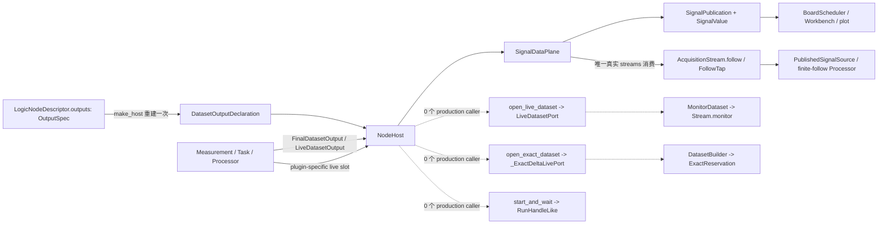

# Step 3-C：`zlc_runtime` 真实消费者与契约删减审计

状态：完成（只读审计，不含代码修改）
审计基线：`92089f5fc037f8a87e8efe834ccf83139aaf4383`
范围：`streams.py`、`dataset.py`、`live_dataset.py`、`preview.py`、`host.py`、`plane.py`、`dataset_output.py`，并向真实 production 调用方反查。
证据规则：当前 production 调用图优先；tests、examples、notebook 和既有文档不构成保留理由。

## 1. 结论先行

七个目标文件合计约 7,723 行。里面存在一座约 4,000 行 production 框架，它由约 2,000 行专门测试和旧合同维持，但没有当前产品消费者：

- exact reservation / cursor / delivery / readiness；
- `DatasetBuilder` / exact preview delta / sealed artifact；
- stream `MonitorTap` / `MonitorDataset`；
- `LiveDatasetPort` / `_ExactDeltaLivePort` / `preview.py`；
- `RunHandleLike` / `NodeExecutionContext.start_and_wait()`。

真正的产品链只使用 `streams.py` 的一小段 follow 行为：`SignalDataPlane` 把 `SignalPublication` 再包进 `AcquisitionStream`，scan 和 finite processor 从 `FollowTap` 读取 future publications。exact、monitor、builder、live-port 均没有被 plane/host 间接使用。

总裁决：

| 文件/契约 | 裁决 | 理由 |
|---|---|---|
| `streams.py` | `MERGE/DELETE` | 保留 `EventRef` 语义与 future-publication follower；删除 exact/monitor/general stream 框架，并把最小 follower 合入 signal plane 契约。 |
| `dataset.py` | `DELETE`，仅 coverage `MOVE` | 除 `DatasetCoverage`、`MonitorCoverage` 外，无 production consumer；coverage 属于 live signal extent，不属于无人使用的 builder。 |
| `live_dataset.py` | `DELETE` | 两种 port 的所有入口均无 product caller；当前六类节点使用自己的 slot，直接走 `attach_live_outputs()`。 |
| `preview.py` | `DELETE` | 只服务上述 dead port；不要与真实的 descriptor `NodePreviewSpec` 混淆。 |
| `dataset_output.py` | `KEEP + MERGE` | declaration 与 output payload 是真实核心；删除两个无人实现的 Protocol/helper，并合并重复的 Final/Live carrier。 |
| `host.py` | `KEEP + REDESIGN` | lifecycle 是真实骨架；删除兼容/测试能力，停止靠 node attribute 猜执行 role，收窄 live API。 |
| `plane.py` | `KEEP + REDESIGN` | Signal publication/front/lineage 是核心；当前 pull-materialize 线程语义、全局单线程 processor lane、stamp/run-record 不变量有实质问题。 |

这不是“缺测试所以看起来没用”。Git 历史反查表明，`open_exact_dataset`、`DatasetBuilder` 和 `open_live_dataset` 自初始 monorepo commit `d20d18b` 起就没有进入 `zlc_atom` 或 `zlc_workbench` 的 production 调用链。

## 2. 真实 production consumer 图

关键边界事实：

1. `AcquisitionStream` 顶层 facade 虽然公开，但仓内 production 没有外部 caller；只有 `plane.py` 内部构造它。
2. `zlc_atom.nodes.scan.source.PublishedSignalSource` 只看 `FollowTap.next().payload` 和 terminal exception；它不看 follow envelope 自己的 stream id/generation/sequence。
3. `host.py` 虽 import `LiveDatasetPort`、`_ExactDeltaLivePort`、exact preview specs，但所有对外入口均无 production caller；这不构成间接使用。
4. 当前真实 live producer 是 plugin-specific slot：camera `_CameraLiveSlot`、scan `ScanLiveSlot`、calibration `CalibrationCapturePreviewSlot` 等。它们只需 `set_change_listener()`、`freeze_live_outputs()`、`close()`。
5. 当前真实 processor 三条 extent 路径都可由产品到达：`MonitorCoverage -> latest-only`、`DatasetCoverage -> follow every publication`、`coverage=None -> retained FINAL one-shot`。不能因 exact builder 是 dead code 而误删 host 的 finite-follow path。

## 3. 最高优先级问题

### R-01 — `freeze()` 不是纯读取；它在不确定线程执行昂贵 materialization

`SignalDataPlane.freeze()` 对 dirty slot 调用 `_freeze_one()`，后者调用插件的 `freeze_live_outputs()`。Board 的正常路径是 `BoardScheduler.on_tick() -> plane.freeze()`，因此 camera 的 `frames_snapshot()`、数组堆叠/复制、schema/value 构造可以直接发生在 UI owner tick 上。

更糟的是，一旦有人调用 `follow_publications()`，`mark_changed()` 会改走 `_publish_followed()`，同一个 `freeze_live_outputs()` 又变成在 producer/acquisition thread 上执行。是否存在一个 follower，会悄悄改变同一插件函数的执行线程和采集阻塞成本。

这解释了两类现象：

- 没有 follower 时，大 frame materialization 会拖慢 UI beat；
- 有 scan/follow processor 时，materialization 会进入 acquisition callback，拖慢采集，并可能与 UI 走完全不同的时序。

裁决：`REDESIGN`。推荐最小目标是一个 Host-owned、线程安全的 `publish_live(outputs)` push 入口：插件在线程中先形成 immutable `LiveDatasetOutput`，plane 只原子替换引用并 wake；`freeze()` 只读已经发布的 front，不再执行插件代码。现有各 plugin 的 listener/slot boilerplate 随之删除。

### R-02 — 所有 latest processor 共用一个全局单线程 executor

`_LatestOnlyProcessorLane` 固定 `ThreadPoolExecutor(max_workers=1)`。每个 processor 自身虽只保留一个 inflight + 一个 pending latest，但不同 processor、不同 panel bridge 之间仍全局串行。一次慢 occupancy/fit/selection projection 会阻塞所有其他 latest processor，形成明确的 head-of-line blocking。

裁决：`REDESIGN`。需要保持“每个 processor 最多一个 inflight、pending 只保留 latest”，但独立 processor 不应共享唯一 worker。可复用 Host 已有 owner mailbox，或使用有界 pool 加 per-entry serialization；最终并发上限需结合真实 profile 决定，但“全局只有一个”不应继续作为隐含语义。

### R-03 — output contract 实际没有按 generation 冻结

`_GenerationState` 只保存 qualified names 和 bare-name mapping，不保存完整 `DatasetOutputDeclaration`。`publish_final()`、`publish_processor()`、`_freeze_one()`、`describe_signals()` 都会重新读取 `node.dataset_output_declarations`。

因此 node 若在同一 generation 内换了某个 `contract_id`，output names 不变即可通过 state identity 检查，plane 会接受新 contract；这与报错文字和文档所称“frozen producer vocabulary”相反。

裁决：`REDESIGN`。在 `begin_generation` 时冻结完整 declaration mapping，此后 publish、description 和 validation 只读 state 中这一份。

### R-04 — “声明了什么”与“发布了什么”允许静默分叉

Worker FINAL 只要求非空 declared subset；live `_freeze_one()` 也只要求 subset。Host 只记录“至少 publish 过一次 final”，不验证 frozen declaration 的每个 output 在 terminal 前都出现。Processor 反而要求完整 output set。

动态/条件 output 已由 descriptor `outputs_for(authored_values)` 解决，所以 run 开始时冻结的 declarations 理应是这一 run 的确切 vocabulary。当前 subset 规则会让新增 output 的 preview 永久等待，却让 node 以 success 结束，是“新增 logic node 看似成功但不显示”的直接契约缺口之一。

裁决：`REDESIGN`。terminal 必须覆盖 frozen declarations；若产品确实需要 optional output，必须在 descriptor 明示 optional，而不是用静默缺席表达。

### R-05 — snapshot stamp 被当作内容身份，但没有 enforce injectivity

`OwnedSnapshot` 只验证 ref 的 block id/revision/schema fingerprint 与本 DataBlock 对齐；它允许创建两份 ref 完全相同、values/validity 不同的 snapshot。runtime 随后在 `finish_live()` 中只比较 `snapshot.ref + coverage + run_record` 就判定 `same_current`，plot/cache 也多处把 ref 当内容 key。

同时系统有两套不相等的 revision/generation：

- `SignalPublication.event_ref`：plane generation + publication sequence，负责 run/causal lineage；
- `OwnedSnapshot.ref`：producer 自己形成的 content generation + revision。

例如 `snapshot_from_array()` 会把 context generation 再加 producer prefix，而 plane `EventRef.generation` 是原始 plane generation；occupancy 又继承/改写 parent snapshot stamp。当前没有合法、统一的等式把二者绑定。`SignalDescription.revision` 实际填的是 publication sequence，但名字又像 snapshot revision。

裁决：`USER DECISION + REDESIGN`。推荐：

1. `EventRef` 是唯一 run/causal identity；
2. `DatasetRevisionRef` 只做 content identity，不再暗示等于 publication generation/sequence；
3. 明确并 enforce `(block_id, content_generation, revision) -> 唯一 schema/values/validity`；不能 enforce 时，去重必须做 exact equality；
4. `SignalDescription.revision` 政名为 `publication_sequence`；
5. parent/derived same-shot 只看 `EventRef` lineage，不拿 snapshot revision 代替。

### R-06 — `run_record` 所谓 immutable 只是浅层只读

`FinalDatasetOutput`/`LiveDatasetOutput` 不复制 `run_record`；`SignalValue` 和 `SignalPublication` 只做 `MappingProxyType(dict(...))`。顶层 key 不可写，但 nested dict/list 仍与 node 原对象共享。当前 test 只验证 top-level late mutation，未验证 nested mutation。

这会让已经发布、以后保存的 run/device provenance 被运行中对象事后改写。

裁决：`REDESIGN`。在首次 output 边界对允许的 plain tree 做一次真正深 snapshot；publication 和 sibling values 共享这一份 immutable tree，不要连续浅拷贝三次。

### R-07 — generic follow 为同一 publication 又造了一套无人读取的 EventRef

plane 的 `SignalPublication` 已有自己的 `event_ref/direct_parent_refs`。把它放入 `AcquisitionStream` 后，stream 又给 envelope 生成另一套 stream id/generation/sequence 和 parent refs。真实 consumer 立即 `.payload` 并丢掉 envelope identity。

这既是冗余 truth，也是 generic stream 可以大幅删除的直接证据。`FollowTap` 的队列还无界；任何“source 永远快于 consumer”的 live source都可无限增长，runtime 没有 backpressure 或有界失败语义。

裁决：`MERGE`。plane 自己维护最小 future-publication subscription：队列项就是 `SignalPublication`，terminal/restart 用一个 plane follower exception 表达。需要 lossless 的 scan 必须由物理 gating/明确 bounded acquisition 保证，不应由无界内存假装保证。

## 4. 逐文件、逐类/函数裁决

### 4.1 `streams.py`（1,937 行）

真实 production consumer：

- `plane.py`：`AcquisitionStream.create/follow`、producer `emit/finish/fail`；
- `host.py`：finite processor 持有 `FollowTap`，只调用 `next/close`；
- `zlc_atom.nodes.scan.source`：通过 plane 间接拿 tap，调用 `next/close`，捕获 `StreamEndedEarly`。

除此之外均为 tests/self-use。

| 符号/方法族 | 真实消费者 | 裁决 |
|---|---|---|
| `_contains_materialization` | generic envelope admission；product 的 `SignalPublication` 因 `MappingProxyType` 恰好绕过递归 | `DELETE`。规则与真实 payload 相矛盾且是偶然绕过。 |
| `PayloadContract` | stream 内部；plane 只用 trivial identity contract | `DELETE/MERGE` 到最小 follower。 |
| `JoinKeyContract` | 只被 dead exact/dataset builder 与 tests 使用 | `DELETE`。 |
| `StreamId`, `EventRef` | plane lineage、presentation/front 间接真实使用 | `KEEP`，建议移到 `plane.py` 或 `zlc_data` 的 lineage owner；不要为它们保留整个 stream 文件。 |
| `event_ref_to_tree/from_tree` | 0 个 production/test caller（除互相 canonical roundtrip） | `DELETE`，除非未来持久化格式出现真实 consumer。 |
| `EventSpanRef` 与 codec | 只服务 dead Dataset seal provenance | `DELETE`。 |
| `Envelope` | 只为 generic stream；真实 follower 丢弃 envelope identity | `DELETE`。 |
| `EndOfStream` | exact builder seal；plane 忽略 `finish()` 返回值 | `DELETE`。 |
| `StreamError`, `StreamEndedEarly`, `SourceFailed` | follower terminal path真实使用 | `MERGE` 成 plane follower 的最小 terminal exception。 |
| `StreamGap`, `SchemaChanged`, `ReservationStateError`, `ReservationState` | exact/monitor/tests | `DELETE`。 |
| `Delivery` | exact cursor/builder/tests | `DELETE`。 |
| `ExactReservation` 全部方法：`activate/bind_consumer/validate/ack/complete/abort/release` | builder/tests | `DELETE`。 |
| `_ObjectReference`, `_CallbackReference`, `ExactConsumerReadiness` 全部方法 | exact reservation/tests | `DELETE`。 |
| `AcquisitionCursor.next/_ack_delivery` | unreserved/exact tests与 builder | `DELETE`。 |
| `MonitorUpdate`, `MonitorTap` 的 `next/latest/close` 及内部 offer/terminal | `MonitorDataset` dead chain + tests | `DELETE`。不要误删 product 的 `MonitorCoverage`。 |
| `FollowTap.next/close` | scan、host finite-follow 间接真实使用 | `KEEP` 语义、`MERGE` 实现到 plane；其 `start_sequence/stream_id/stream_generation/next_sequence` 均无 product caller。 |
| `AcquisitionProducer.emit/finish/fail` | plane 内部真实使用 | `MERGE` 到 plane publication follower；`supersede` 无 product caller，`DELETE`。 |
| `AcquisitionStream.create/follow` | 仅 plane 内部真实使用 | `MERGE`；不再保持顶层 public generic API。 |
| `AcquisitionStream.reserve/subscribe/monitor/wait_until_sequence/retained_events` | tests/dead builder；`wait_until_sequence` 连 tests 都没有 | `DELETE`。 |
| stream exact ack/claim/trim/private retention 方法族 | exact tests/dead builder | `DELETE`。 |

删除影响：顶层 facade 去掉 `AcquisitionStream`；`scan.source` 的 terminal import 改到 plane/runtime facade；plane 的 `_GenerationState.publication_stream/publication_producer` 改为小 follower registry。`test_runtime_streams.py` 只保留少量真实 future-follow/restart/terminal 行为并迁入 plane/scan tests，其余删除。

### 4.2 `dataset.py`（1,809 行）

真实 production consumer 只有两种 coverage value。其余类型从未进入 `zlc_atom`、`zlc_workbench` 或 durable production。

| 符号/方法族 | 真实消费者 | 裁决 |
|---|---|---|
| `DatasetCoverage` | camera/scan/calibration/SLM/temperature/occupancy、host、plane、dataset output | `KEEP + MOVE` 到 `dataset_output.py` 或 `plane.py`。 |
| `MonitorCoverage` | camera monitor、selection bridge、host、plane | `KEEP + MOVE`。它与 finite coverage 同字段但作为 extent tag 有真实分流意义。 |
| `DatasetEventAdapter`, `DatasetMetadataContract` | 仅本文件/dead builder/tests | `DELETE`。 |
| `DatasetError`, `MissingDatasetCells`, `SnapshotExpired` | 仅 dead materializers/tests | `DELETE`。 |
| `_is_deeply_immutable` | 仅 dead edge/metadata path | `DELETE`；run_record 真正需要的 deep snapshot 应在 output owner另行实现。 |
| `DatasetCellAddress`, `_validated_cell_permutation`, `DatasetCellKeyContract`, `DatasetCellSchedule` 全部方法 | exact builder/tests | `DELETE`。 |
| `FrozenDatasetEdge` 全部方法 | exact/monitor builder与 preview spec | `DELETE`。 |
| `DatasetPreviewSnapshot/Cell/Delta` | dead exact preview/output helper | `DELETE`。 |
| `MonitorDatasetSnapshot` | dead `LiveDatasetPort`/output helper | `DELETE`。 |
| `DatasetSealProvenance`、四个 codec、`SealedDatasetArtifact` | 无 production consumer | `DELETE`。 |
| `_new_validity_storage/_value_validity_mask/_materialized_validity/_project_payload/_write_cell` | builders only | `DELETE`。 |
| `DatasetBuilder`：`consume/materialize/materialize_delta/seal/abort/exact_readiness/open_preview_reader/close` | tests 与 dead exact port | `DELETE`。 |
| `ExactDatasetPreviewReader` 全部 property/`freeze_delta` | dead exact port | `DELETE`。 |
| `_LatestCellReplacement` | `MonitorDataset` internal only | `DELETE`。 |
| `MonitorDataset.keyed_cycle/latest_cell/ingest*/replacement*/freeze/materialize/close` | dead `LiveDatasetPort` + tests | `DELETE`。 |
| `_validate_dataset_ref`, `_close_preserving_body_error` | dead builders only | `DELETE`。 |

`DatasetBuilder` 的内部不变量本身写得严谨，不等于它有产品必要性。当前 camera、scan、calibration 分别使用自己的直接 writer/slot；旧计划写着“finite measurement 使用 exact reservation + dataset builder”，但这个迁移从未发生。默认删原则下，不应为了旧计划或 998 行 builder tests 保留未接线框架。

删除影响：更新 `host.py`、`plane.py`、`selection_bridge.py`、`dataset_output.py` 和六个 atom plugin 的 coverage import；`test_runtime_dataset_builder.py` 除 coverage 小测试外整体删除。实际 Dataset/Snapshot/validity owner 仍是 `zlc_data`，不会丢失产品数据模型。

### 4.3 `live_dataset.py`（478 行）

| 符号/方法族 | 真实消费者 | 裁决 |
|---|---|---|
| `_required_message` | 两个 dead port | `DELETE`。 |
| `LiveDatasetPort`：properties、`set_change_listener/bind/updated/freeze_current/freeze_live_outputs/fail/source_terminal/close` | 只有 `NodeExecutionContext.open_live_dataset()` 与 tests；该 context 方法 0 个 production caller | `DELETE`。 |
| `_ExactDeltaLivePort`：worker、bind/update/delta drain/fail/terminal/close | 只有 `open_exact_dataset()`；该方法 0 个 production caller | `DELETE`。 |

当前真实 slot 没有实现这里的 `bind(dataset)` 协议，也没有任何 production class 实现 `live_dataset_outputs()` 或外部 `freeze_current()`。因此不能把 host import 当作使用证据。

删除影响：删掉 host 的 `open_live_dataset/open_exact_dataset`；删对应 helper/import-guard tests。真实 plugin slot 暂时不受影响；若采用 R-01 的 `publish_live(outputs)`，它们随后也可逐个删除。

### 4.4 `preview.py`（85 行）

| 符号 | 真实消费者 | 裁决 |
|---|---|---|
| `LiveDatasetViewSpec` | dead `LiveDatasetPort` | `DELETE`。 |
| `ExactDatasetPreviewSpec` | dead exact port/host API | `DELETE`。 |
| `ExactDatasetPreviewPort` | 无实现者除 dead exact port 的结构吻合 | `DELETE`。 |
| `FailureAwarePreviewPort`, `notify_preview_failure` | 无 production caller | `DELETE`。 |

这里的 “preview” 是旧 Dataset reader attachment，不是当前真实的 `LogicNodeDescriptor.NodePreviewSpec -> Workbench auto panel`。两个概念同名反而增加误导。

### 4.5 `dataset_output.py`（162 行）

| 符号 | 真实消费者 | 裁决 |
|---|---|---|
| `DatasetOutputDeclaration` | descriptor-to-host、所有 producer、plane validation | `KEEP`，并成为 descriptor output 唯一类型。 |
| `FinalDatasetOutput` | camera/scan/temperature等 final publish | `MERGE`。 |
| `LiveDatasetOutput` | 所有 live producer/processor/selection bridge | `MERGE`。 |
| `LiveDatasetOutputOwner` | 0 个 production implementation/caller | `DELETE`。 |
| `LiveDatasetSnapshotSource` | 只有 dead `MonitorDataset`/port | `DELETE`。 |
| `single_live_dataset_output` | 0 个 production caller | `DELETE`。 |

`FinalDatasetOutput` 与 `LiveDatasetOutput` 重复 declaration/snapshot/run_record/property/validation；唯一差异是 coverage，而调用入口 `publish_final` 或 `publish_live` 已经说明阶段。推荐一个 `DatasetOutput(declaration, snapshot, coverage=None, run_record=...)`；plane 在 live 入口要求 coverage，final 入口要求/规范为 None。terminal processor 当前本来就在丢弃 `LiveDatasetOutput.coverage` 后发布 final，这证明两种 carrier 不是两种稳定实体。

另外，`zlc_atom.nodes._framework.descriptor.OutputSpec` 与 `DatasetOutputDeclaration` 字段完全相同。`make_host()` 每次把前者重建成后者；occupancy descriptor 甚至再次手写五组字符串。裁决：`MERGE`，descriptor 的 `outputs/resolve_outputs/outputs_for` 直接使用唯一 declaration。这样 contract id/name 只声明一次，新增 logic node 不再依赖人工同步两种 DTO。

### 4.6 `host.py`（1,157 行）

真实唯一构造点是 `zlc_workbench.logic.make_host()`；仓内 production 没有其他 `NodeHost(...)`。

| 符号/方法族 | 真实消费者 | 裁决 |
|---|---|---|
| `_StartSuppressed` | worker cancellation/terminal seal | `KEEP` private。 |
| 空 `Node(Protocol)` | 只作无约束 type hint | `DELETE`；它没有声明任何能力。 |
| `NodeProgress`, `LogicNodeObservation` | Workbench status/progress | `KEEP`；删 dead `run_snapshot`/warnings 后可收窄。 |
| `NodeExecutionContext.generation/cancel_requested/seal_terminal/attach_live_outputs/publish_final/report_progress` | 均有真实 node caller | `KEEP`；`attach_live_outputs` 按 R-01 改成直接 `publish_live`。 |
| `NodeExecutionContext.start_and_wait` | tests only | `DELETE`。 |
| `NodeExecutionContext.open_live_dataset/open_exact_dataset` | 0 个 production caller | `DELETE`。 |
| `NodeExecutionContext.warn` | 0 个 production caller；UI虽能显示 warnings，但没有 node 发布 | `DELETE`，出现真实需求时再用最小入口加入。 |
| `NodeHost.create` | 0 个 production caller | `DELETE`。 |
| `_resolve_names`、`dataset_output_names/output_names` fallback、自动造 `runtime.{instance}.{name}` contract | production 总是显式传 declarations | `DELETE`；自动造 contract 会掩盖 descriptor 漏声明。 |
| `_resolve_declarations` | declaration freeze需要，但只保留“显式、非空、唯一 declaration tuple” | `REDESIGN`。 |
| `_resolve_source_signal` | 当前靠 node 属性猜 role | `DELETE/REDESIGN`，见下。 |
| `dataset_output_declarations/signal_key/published_signals/running/terminal/final_result/final_result_resolved/observation/start/cancel/poll/shutdown` | Workbench/plane真实使用 | `KEEP`。 |
| `node/source_signal/phase/last_error/handle` properties | production 0 caller（phase/error已有 observation） | `DELETE`。 |
| `worker_idle` | host internal only | `PRIVATE`。 |
| RunHandle fields、snapshot polling、cancel handle、`_start_and_wait` | tests only | `DELETE`；同时删 `_public.py` 的 `RunHandleLike` 和 `owner_mailbox` handle storage。 |
| worker lifecycle/cancel/seal/final/live cleanup 方法族 | 真实核心 | `KEEP + 简化`。 |
| latest/frozen/follow processor 三路径 | 均可由当前 source extent 到达 | `KEEP`，不要与 dead exact builder 混删。 |
| processor callbacks (`validate/evaluate/accept*/wake`) | plane latest lane真实调用 | `KEEP`，可改成更小的 host/plane internal interface。 |

#### Node role 推断

当前 mode 由 node 是否恰好拥有 `input_signal`、`source_signal` 或 `input_signals` 属性推断。它碰巧对当前节点成立：occupancy 有 `.source_signal`，其他 worker 没有。但 descriptor 已明确有 `NodeKind.PROCESSOR`，Workbench 也持有最终 `source_signal`；`make_host()` 却没有把这个事实传给 Host。

这会产生两种未来错误：

- 新 Processor 若没有把 source 保存成 Host 猜的三个属性之一，会被当 worker，随后报“缺 execute”；
- 一个 Measurement/Task 若仅为业务记录保存了同名属性，会被误当 Processor，随后报“缺 evaluate”。

不能简单用 `DatasetInputSpec` 推断，因为 stepped/seamless scan 是有 Dataset input 的 Measurement worker：它主动采样 source，不是 source 每发布一次就 reactive evaluate。

裁决：`REDESIGN`。由唯一 composition owner 显式传 execution mode/source：`descriptor.kind is PROCESSOR` 时传最终 source，其余一律 worker。不新增 role enum；也不再在 Host 内反射 node 属性。

另一个重复真相：Workbench `stable_signal_key()` 与 Host 默认 lambda 都写了 `@logic/{owner}/{name}`。推荐 runtime 提供唯一 signal-key function，Workbench 直接调用；或 composition 显式把同一个 function 传入，而不是两处字面量碰巧一致。

### 4.7 `plane.py`（2,095 行）

| 符号/方法族 | 真实消费者 | 裁决 |
|---|---|---|
| `_run_records_equal` | sibling/run validation | `KEEP` 语义；在 deep snapshot 后简化。 |
| `SignalProducer` | Host、direct camera、bridge processor 的真实结构边界 | `KEEP`，可降为 internal protocol。 |
| `LatestProcessorControl` | 仅 private lane | `PRIVATE`；不必列为 public `__all__`。 |
| `SignalValue` + block/schema/value projections | atom processors、plot、Workbench | `KEEP + REDESIGN` stamp/run_record。 |
| `SignalDescription` | Workbench signal pickers/topology/status | `KEEP`；`revision` 改为明确的 publication sequence。 |
| `SignalPublication` | lineage、front、presentation、save | `KEEP`；它是 run/causal truth。 |
| `_SignalPublicationPayloadContract` | 只为 generic stream | `DELETE`。 |
| `SignalFront` | Board/presentation/Workbench | `KEEP`；正式 validation 不应只放在 `assert`（`python -O` 会消失）。 |
| declaration/run-record helper | plane核心 | `KEEP/MERGE`，改为读取 generation-frozen declarations。 |
| `_GenerationState` | plane核心 | `KEEP + 收窄`；保存完整 frozen declarations和最小 follower registry。 |
| `_ProcessorEntry`, `_LatestOnlyProcessorLane` | latest Processor/selection bridge | `REDESIGN`，消除全局单 worker。 |
| `bind_owner_wake/unbind_owner_wake` | presentation owner channels | `KEEP`。 |
| `set_front_signals` | BoardScheduler | `KEEP`。 |
| `reserve` | production 只由 `begin_generation` 调；其余 tests/examples | `PRIVATE/INLINE`；删除 public lower-level入口。 |
| `begin_generation` | Host、direct camera | `KEEP`。 |
| `attach/mark_changed/_publish_followed/_freeze_one` | 当前 live product | `REDESIGN` 为 push live；避免 caller-thread plugin execution。 |
| `describe_signals/is_generation_live/latest_publication` | Workbench/scans/bridge/host | `KEEP`。 |
| `follow_publications` | scan与 finite-follow processor | `KEEP` product behavior，替换 generic stream实现。 |
| `follower_edges/direct_parent_publications` | presentation/panel save | `KEEP`。 |
| latest/frozen/follow processor reserve/attach/cancel/withdraw | Host/SelectionBridge | `KEEP`，可收窄为 package internal。 |
| `publish_final/publish_processor/publish_terminal_processor` | Host/bridge | `KEEP + MERGE output carrier + 完整 declaration检查`。 |
| retirement/cleanup/retire/finish_live/detach_live | Host/direct camera | `KEEP`；push live 后可显著简化 slot cleanup。 |
| `freeze` | Board/Workbench/scan | `KEEP` 但改为纯 front read/pump completed processor，不调用 plugin。 |
| `close` | Session lifecycle | `KEEP`。 |
| `__len__` | tests only | `DELETE`。 |

## 5. Tests 裁决

| 测试文件/区域 | 裁决 |
|---|---|
| `test_runtime_streams.py`（793 行） | 删除 exact/monitor/reservation/schema-change/ack 测试；只把真实 future-follow 的 ordered/terminal/restart 行为改写成 plane-level tests。 |
| `test_runtime_dataset_builder.py`（998 行） | 除 coverage validation 外整体删除。它守的是没有产品 caller 的框架。 |
| `test_runtime_helpers.py` 的 preview/live port tests | 删除；failure/cleanup/owner-mailbox真实 tests保留。 |
| `test_host.py` 的 RunHandle capability、`open_live_dataset` singleton tests | 删除；worker cancellation、progress、live publication、三种 processor extent tests保留并对准简化后的 production API。 |
| `test_import_guards.py` / `test_acceptance_fixtures.py` | 删除对 `AcquisitionStream`、ExactReservation、MonitorTap、LiveDatasetPort、RunHandleLike 的 API 存在性断言；它们不能反过来定义产品。 |
| `test_generation_lifecycle.py` 的 public `reserve` tests | 改为 `begin_generation` 的真实 restart/retained-result语义；“reserve alone”是 lower-level implementation测试，删除。 |
| signal plane/front/presentation/hosted nodes/real runtime integration | 保留；这些覆盖真实 composition 路径。增加 nested run_record mutation、frozen contract id、missing declared terminal output、duplicate snapshot ref、independent processor concurrency。 |

## 6. 文档—实现矛盾

| 文档说法 | 当前代码事实 | 裁决 |
|---|---|---|
| runtime README 称这是围绕 `streams.py`/`dataset.py` 的“小 contract package” | 两文件合计 3,746 行；除 minimal follow 和 coverage 外没有产品 consumer | 文档把历史框架写成核心，不能作为保留证据。 |
| `docs/contract.md` 把 exact/monitor/live-port/RunHandle 列为公开合同 | 当前 product nodes 从未调用这些入口 | 合同描述的是测试维护的 API，不是产品合同。删代码后重写，不做兼容。 |
| `IMPLEMENTATION_PLAN` Phase 2 要 finite measurement 使用 exact reservation + builder | camera/scan/calibration 均使用直接 writer/plugin slot；Git 历史中从未接入 builder | 需用户决定是迁移全部产品还是删除框架；审计推荐删除。 |
| 计划称 Task preview/final 都走“声明式 NodeHost contract” | 每个插件仍要自造 slot、listener、snapshot stamp，并手动记 attach/update | 实现没有把“新 node 默认 live/preview 正确”做成框架契约。采用 push live 后重写。 |
| Architecture 要 Calibration preview 只显示最新 complete cycle 的最后一张 `R=1,P=1` image | 当前 `CalibrationCapturePreviewSlot` 发布三 frame point rows、`DatasetCoverage(3,3)` | 产品语义冲突，需 Calibration 专项由用户裁决；runtime 不应靠 dead `MonitorDataset` 解决。 |
| plane 文档称 owner declarations/frozen vocabulary | generation state 不冻结 contract id，发布时重读 node property | 文档承诺未实现。 |
| `SignalValue`/publication 文档称 immutable `run_record` | nested containers仍可变且共享 | 文档承诺未实现。 |

## 7. 需要用户裁决的四个点

### C3-1 — `zlc_runtime` 是当前产品 runtime，还是未来通用 acquisition library

- 选项 A（推荐）：服务当前产品。删 exact/monitor/builder/live-preview/RunHandle 岛；未来出现第二个真实 consumer 再提取最小公共部分。
- 选项 B：保留未来通用库。则必须明确仓外 consumer、版本兼容和独立 acceptance；仅凭 tests/examples 不足。

### C3-2 — snapshot 与 publication 的身份关系

- 选项 A（推荐）：`EventRef` 唯一负责 run/causality；`DatasetRevisionRef` 只负责 content identity并 enforce injectivity。
- 选项 B：强制 snapshot generation/revision 等于 publication generation/sequence。需要迁移所有 producer/derived projection，改动明显更大。

### C3-3 — live 发布 API

- 选项 A（推荐）：`context.publish_live(outputs)` push immutable outputs；Host/plane统一做声明、generation、terminal与wake。
- 选项 B：保留 plugin slot，但必须规定 materialization 线程、成本和完整 output 规则；当前“有 follower 就换线程”不可保留。

### C3-4 — latest processor 并发

- 选项 A（推荐）：每 processor串行，processor之间可并发，设置明确的有界全局上限。
- 选项 B：继续全局单 worker，并接受任一慢 processor 会拖住所有 fit/occupancy/selection。

## 8. 推荐的最小目标契约

删减后 runtime 的数据骨架只需要：

1. `DatasetOutputDeclaration`（同时给 descriptor、node、Host、plane 使用）；
2. 一个 `DatasetOutput` carrier + `DatasetCoverage/MonitorCoverage`；
3. `SignalValue`、`SignalPublication(EventRef)`、`SignalFront`、`SignalDescription`；
4. `SignalDataPlane` 的 generation、push live/final、processor lineage、future-publication follower、freeze front、retirement；
5. 收窄后的 `NodeExecutionContext` 与 `NodeHost` lifecycle；
6. presentation/selection 真实消费者所需的 lineage 查询。

推荐实施顺序（本审计不执行）：

1. 先冻结唯一 declaration 与 stamp/run-record invariant，并补真实路径回归；
2. 将 live slot pull 改成 push，保证 UI `freeze()` 不执行 plugin materialization；
3. 用 plane-local minimal follower 替换 generic `AcquisitionStream`；
4. 删除 `dataset.py` dead island、`live_dataset.py`、`preview.py`、RunHandle surface及其 tests/docs；
5. 合并 `OutputSpec`/`DatasetOutputDeclaration` 与 Final/Live carrier；
6. 解除 latest processor 全局单线程 head-of-line blocking，并用真实 UI/profile验收。

最终判断：当前主要问题不是“公共能力太少”，而是两套互不相干的 runtime 并存——产品实际使用 plugin slot + signal plane，测试/旧合同维护 exact/monitor/builder/live-port。继续在两边补功能只会让新增 node 更容易漏发布、漏 preview、漏同步。应保留真实 SignalDataPlane/NodeHost 骨架，删除未接线框架，并把 live publication、declaration 和 identity 收成一条可强制执行的路径。
