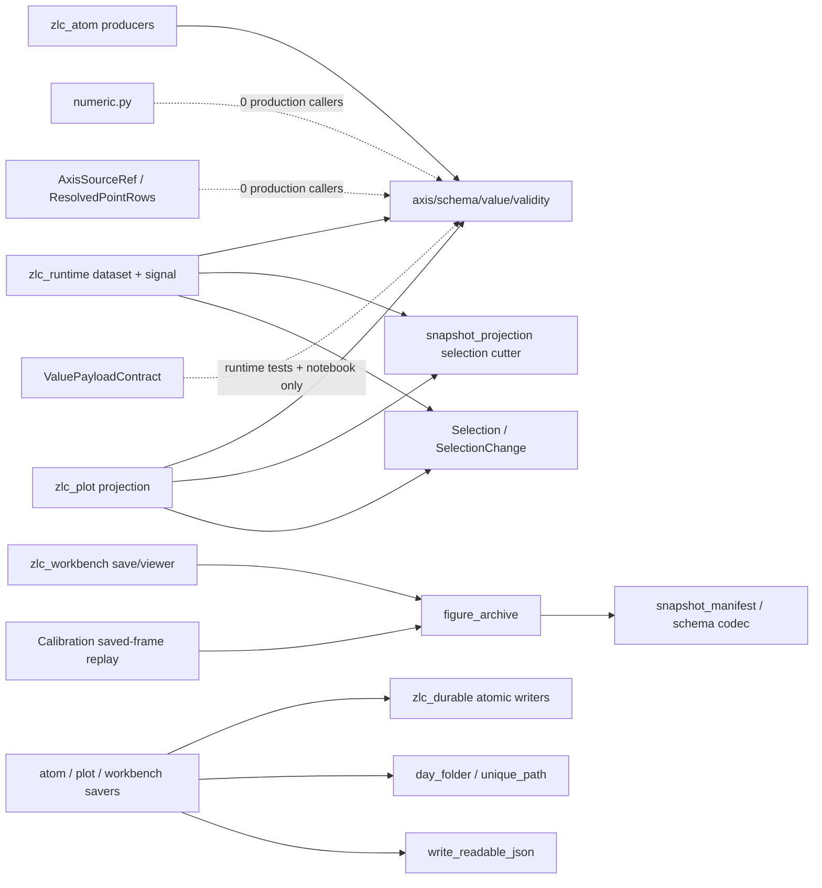

# Step 6-A：`zlc_data` / `zlc_durable` 全量只读审计

状态：完成（只读审计；仅新增本报告，不修改 production、tests 或旧文档）
审计基线：`92089f5fc037f8a87e8efe834ccf83139aaf4383`
范围：两个 package 的全部 source、tests、public exports、README/docs/GOAL/notebook/metadata，以及全仓真实 production consumers。
证据规则：当前 production 调用图、源码不变量和隔离反例优先；tests、notebook、旧 acceptance/contract 自称权威不构成保留理由。

## 1. 结论先行

`zlc_data` 的核心模型应保留：role-axis schema、immutable snapshot、typed validity、严格 standalone NPZ manifest，以及 runtime/plot 正在使用的 selection/projection primitive 都有真实必要性。`zlc_durable` 的 same-directory temp + file fsync + replace + directory flush 也是正确的底层骨架。

但当前两包并未达到“底层绿，所以可信”的程度：

1. `snapshot_projection` 在真实 selector/fit scope 路径中丢失 `coordinate_labels`，某些 implicit labeled axis 甚至无法裁剪；
2. figure archive 对 array key 没有唯一性约束，合法输入可静默覆盖 snapshot validity，写出的文件随后打不开；
3. figure reader 不检查自己的 `FIGURE_SCHEMA`、exact shape、duplicate JSON keys 或非有限 JSON，外层版本字段目前没有约束作用；
4. `unique_path()` 没有原子占位，32 个并发调用实测全部得到同一个 `shot.npz`；后续 `os.replace` 会互相覆盖；
5. dense validity convenience 会把整数、float、NaN 等先强制转 bool；实测全 `2` mask 被接受成 `Valid`；
6. `value_selection()` 对重名 axis label 静默选择最后一个 axis，对 text coordinate 直接 `float()` 失败；
7. `numeric.py`、`AxisSourceRef -> ResolvedPointRows` cluster、`ValuePayloadContract` 等由测试、notebook和手抄 public allow-list 保活，当前 production consumer 为零；
8. `zlc_data` 的两个 import/version 测试实际读取旧 standalone editable install，属于明确 false green；
9. notebook test 不执行 notebook，当前 source 和保存 output 已经不一致仍全绿；
10. public API、distribution version/Python floor、figure format 常量和 live ownership 都存在多份互相矛盾的真相。

总体裁决：

| 包 | 裁决 | 核心理由 |
|---|---|---|
| `zlc_data` | `KEEP core + REDESIGN projection/archive + DELETE dead clusters + USER DECISION public/distribution contract` | 数据模型真实在用；projection 与 composite archive 有已复现数据损坏；历史 public surface 明显膨胀。 |
| `zlc_durable` | `KEEP atomic core + REDESIGN unique naming + PASS WITH DEBT readable/path API + USER DECISION public low-level surface` | 原子替换实现有真实价值；“unique”只在单 caller 顺序执行下成立。 |

## 2. 验证证据

### 2.1 当前测试基线

验证进程先打印了实际路径：

```text
root    C:\Users\eadri\Dropbox\WorkCode\Github\Zou_lab_control_v2\zou_lab_control_v2\__init__.py
data    C:\Users\eadri\Dropbox\WorkCode\Github\Zou_lab_control_v2\packages\zlc_data\src\zlc_data\__init__.py
durable C:\Users\eadri\Dropbox\WorkCode\Github\Zou_lab_control_v2\packages\zlc_durable\src\zlc_durable\__init__.py
```

关闭 pytest cache provider 和 bytecode 写入后：

```text
zlc_data     65 passed
zlc_durable  20 passed
combined     85 passed in 0.95 s
```

以下隔离反例仍全部成立：

| 探针 | 实际结果 |
|---|---|
| 32 threads 同时 `unique_path(folder, "shot", ".npz")` | `1 distinct of 32`，全部为 `shot.npz` |
| `unique_path(folder, "scan", ".x/inside")` | 接受 suffix 中路径分隔，返回不存在的 `scan.x/inside` parent |
| `write_readable_json("relative.json", ...)` | 文件正确写到绝对 cwd，返回值仍是相对 `relative.json` |
| `readable_json({1: "integer", "1": "text"})` | 写出两个 `"1"`；`json.loads` 后只剩后者 |
| `compact_dataset_validity(mask=2, ...)` | 接受并返回 `Valid` |
| crop explicit Axis/PointColumn labels | 两者 `coordinate_labels` 均变成 `None` |
| crop implicit labeled repeat axis | `ValueError: axis coordinate_labels length must match axis size` |
| 两个 axis 都叫 `same` | `value_selection({"same": 0})` 静默选择最后一个 data axis |
| text point coordinate `"a"` | `ValueError: could not convert string to float` |
| archive 同时含 snapshot `data` 与 bare array `data.validity` | bare array 覆盖真实 validity；`read_dataset` 随后因 mask shape 报错 |

### 2.2 测试自身解析错仓

`test_package_guards.py:214-219` 的 `metadata.version("zlc-data")` 实际来自：

```text
...Python313\Lib\site-packages\zlc_data-0.1.0.dist-info
direct_url = file:///C:/Users/eadri/Dropbox/WorkCode/Github/zlc_data
```

即旧 standalone editable，而不是当前 monorepo。当前 checkout 自身没有 `zlc-data` dist-info。

`test_zlc_data_kernel.py:508-515` 的裸 subprocess `import zlc_data` 也实测解析到：

```text
C:\Users\eadri\Dropbox\WorkCode\Github\zlc_data\src\zlc_data\__init__.py
```

所以 combined 85 green 中，至少这两项不是当前树证据。

## 3. 真实 production consumer 图



关键调用事实：

- `axis.py`、`schema.py`、`validity.py`、`value.py` 是 atom/runtime/plot 的真实底座；
- `snapshot_projection.py` 的 cutter 被 `zlc_runtime.selection_bridge` 与 `zlc_plot._fit_projection` 直接使用；
- `figure_archive.py` 被 Workbench archive/viewer 和 Calibration saved-frame replay 使用；
- standalone `save_npz/load_npz` 当前只有 tests/notebook，但它们是合理的公共库能力，不应与 dead helper 混为一谈；
- `zlc_durable` 的 atomic writers、readable JSON、day routing、unique naming 都有多个 production consumers；
- `resolve_under`、`durable_mkdir/makedirs`、`flush_directory`、`day_folder_name` 当前只有包内调用/测试；是否继续 top-level public 是 API 取舍，不是 production 必需。

## 4. 最高风险问题

### DATA-01 — snapshot restriction 会丢 display identity，或直接拒绝合法 labeled axis

位置：`zlc_data/snapshot_projection.py:268-309`。

`_subset_axis()` 对显式 axis 重新构造 `AxisSpec` 时没有传 `coordinate_labels`；`_subset_point_table()` 重建 `PointColumn` 时也没有传。对 implicit axis 的 contiguous range 又用 `replace(size=...)` 保留整条旧 labels，导致 length 与新 size 不同。

真实终态：

- selector ROI、facet scope、fit scope 后的人类 label 消失；
- text/site/model label 可退化成裸 ordinal；
- implicit labeled repeat axis 的 scope 直接失败；
- schema fingerprint 随错误 projection 改变，问题不只在显示层。

裁决：`REDESIGN`。`_subset_axis` 和 `_subset_point_table` 必须逐 index 同时裁剪 coordinate 与 label；implicit axis 只在 coordinates 与 labels 都能保持 implicit representation 时保留 implicit，否则显式化为同步的 coordinate/label tuple。

### DATA-02 — figure archive array namespace 可静默互相覆盖

位置：`zlc_data/figure_archive.py:93-119`，底层 `snapshot_manifest()` 也直接写 caller-owned dict。

当前 array key 先 `str(key)`，snapshot validity 又自动取 `<key>.validity`，但没有任何 collision check。以下都会产生覆盖：

- snapshot `data` + bare array `data.validity`；
- key `1` + key `"1"`；
- 多个原始 key 经 `str()` 后同名；
- caller key 与未来 reserved member 同名。

另外，reserved `info` 是在原始 mapping 上检查、不是在 `str(key)` 后检查；自定义 key 只要 `str(key) == "info"` 就能绕过检查并覆盖真正 metadata。bare object ndarray 也会被 writer 接受，但 reader 使用安全的 `allow_pickle=False`，于是 encoder 能成功生成一个自己的 reader 必定拒绝的文件。

这不是“坏文件输入”：是合法 `figure_bytes()` 调用在 encoder 内丢数据。隔离探针已使 validity 被覆盖，并得到无法重开的 archive。

裁决：`REDESIGN`。进入 encoder 时只接受 canonical non-empty string keys和pickle-free numeric/bool arrays；先规划完整 member namespace，再一次检查唯一性和 reserved names，确认无冲突后才写任何 entry。`snapshot_manifest()` 自己也不得静默覆盖 caller dict。

### DATA-03 — figure format reader没有执行自己的版本/shape契约

位置：`zlc_data/figure_archive.py:137-166`。

`read_archive()` 只检查有没有 `info`，随后普通 `json.loads`：

- 不验证 `FIGURE_SCHEMA`；
- 不验证 top-level exact keys；
- 不验证 info 是 scalar Unicode；
- duplicate JSON key 后者覆盖前者；
- Python JSON 默认接受 `NaN/Infinity`；
- 不验证 `name/sections/dataset` 类型。

因此 `FIGURE_SCHEMA = "zlc.figure/v1"` 当前只被 writer 写出，reader 从不执行。与同包 `io.load_npz()` 的 strict decoder 相比，这是明显的双标准。

裁决：`REDESIGN`。复用 strict JSON object/constant policy，给 outer figure document 与 dataset section exact grammar；owner-level malformed tests 必须落在 `zlc_data`，Workbench 只测保存策略。

### DATA-04 — `_jsonable()` 会把未知 provenance 静默改成字符串

位置：`zlc_data/figure_archive.py:53-69`。

它正确拒绝 ndarray，却对任何其他未知对象 `return str(value)`；mapping key 也统一 `str()`，set 以不稳定 iteration order 转 list。结果是一个 device/plugin 不小心交出 complex、Path-like、自定义 DTO 或冲突 key 时，archive 仍“成功”，但类型和可能部分内容已经丢失。

裁决：`REDESIGN`。archive metadata boundary 只接受明确 JSON scalar/list/string-key mapping 与允许的 NumPy scalar；未知对象应报出完整 field path。是否显式允许 `Path`/Enum 必须由 section owner先投影，不由 data archive猜。

### DATA-05 — dense validity convenience 会把错误 mask 当 truth

位置：`zlc_data/value.py:407-442`，入口还包括 `owned_snapshot_from_arrays():251-258`。

`compact_dataset_validity()` 首行 `np.asarray(mask, dtype=np.bool_)`，所以整数 `2`、float `NaN`、非空字符串都可能变成 `True`。typed `CellValidity`/`ComponentValidity` 反而严格要求 bool，两个入口不一致。

裁决：`REDESIGN`。先读取原 dtype 并要求 exact `bool`，再做 compaction；不要在科学有效性边界做 truthiness coercion。增加 numeric/NaN/object mask refusal测试。

### DATA-06 — `value_selection()` 的 label解析既不唯一，也不支持模型已经允许的 text coordinate

位置：`zlc_data/snapshot_projection.py:366-405`。

`axis_catalog()` 同时列 name 与 id alias，而 `value_selection()` 用 dict comprehension 建表：两个 axis 同名时最后一个静默覆盖前者。implicit axis 对输入先 `int(value)`，因此 `1.9` 静默截成 index `1`；显式 coordinate 又无条件 `float(value)`，使 `PointColumn.TEXT` 虽是正式 schema 能力，却不能用于 plot scope，超大 integer coordinate也会经过float丢精度。

另一个同链问题位于 `selection.py:248-252`：`PointColumn.NUMERIC` 正式允许 `None` 表示缺失 coordinate，但范围 resolver只要发现任意一个 `None` 就拒绝整条 axis。`(0, None, 2)` 上选 `[0,2]` 会失败，而不是保留两个有效 row、跳过缺失 row。

`zlc_plot._fit_projection._scoped_data()` 是真实 consumer，所以这是 production 缺陷。

裁决：`REDESIGN`。label 必须恰好解析到一个 axis，否则明确 ambiguity；implicit coordinate必须要求exact integer，不得截断；text coordinate用exact matching转 `IndexSelection`，numeric range跳过missing row。优先使用 AxisId 而不是 human name作为跨层 identity。

### DATA-07 — DatasetRevisionRef 可重复命名不同内容

位置：`zlc_data/value.py:63-79, 121-181`。

`OwnedSnapshot` 只验证 ref 与本 block 的 block id/revision/schema fingerprint相符；两个不同 Python 对象可以持有完全相同 ref、不同 values/validity。schema fingerprint 只绑定 schema，不绑定内容。Runtime/plot 又多处把 ref 当去重/cache key。

这是跨包 identity 语义缺口，不适合由 stateless `zlc_data` 私自造全局 registry。

裁决：`USER DECISION + REDESIGN`：

- 推荐 EventRef 继续拥有 run/causal identity；
- DatasetRevisionRef 明确为 producer承诺的 content identity；
- runtime generation owner 对同一 ref enforce exact content injectivity，或任何同-ref去重都必须 exact compare；
- 不建议为 values 新增产品 hash。

### DATA-08 — derived materializer没有决定 generation 是否必须继承

位置：`zlc_data/snapshot_projection.py:50-68`。

`_derived_reference()` 强制不同 BlockId、相同 revision、正确 schema fingerprint，却不检查 `stream_generation`。当前 selection bridge通常继承 source generation，但 API 允许 caller 传另一 generation。

裁决：`USER DECISION`。若 DatasetRevisionRef 的 generation 表示 content stream，derived output是否开新 stream必须在契约中明确；不能继续依赖每个 `reference_for` 猜。same-shot 本身仍应只看 runtime EventRef lineage。

### DATA-09 — composite figure encoder把完整压缩文件先堆在内存

位置：`zlc_data/figure_archive.py:129-134`。

`figure_bytes()` 用 `BytesIO` 生成完整 compressed NPZ，再由 Workbench `atomic_write_bytes()` 写入另一个 same-directory temp。大 finite camera snapshot 会同时占有原数组、压缩 buffer/bytes与写入 buffer，无法流式提交。

文件注释还声称数组分离后外部 reader可以 memory-map；实际格式是 `np.savez_compressed`，reader又在关闭zip前把全部成员取出，不能 memory-map。

裁决：`PASS WITH DEBT -> REDESIGN before large-shot archive`。保留 bytes API给小型/notebook caller，但 production save应由 `atomic_write_file()` 把 zlc_data encoder直接写入 temp stream，避免整文件 bytes materialization；同步修正文档的memory-map宣称。

### DATA-10 — selection live路径每revision重复规划同一schema

`axis_catalog()` 每次把完整 PointColumn 重建成 AxisSpec；`selection_indices()` 无论是否选择 point axis都先建立 `set(range(P))`；`_subset_point_table()` 复制全部 surviving coordinates；`restricted_schema()` 再建全套 schema并触发新fingerprint。SelectionBridge 对累计增长snapshot每revision重复走该链，形成 `O(revisions × point rows/metadata)`，增长数据可表现为 O(N²)。

裁决：`REDESIGN`。同一 source schema fingerprint + committed selection 的 index/derived-schema plan只计算一次；新revision只切 values/validity。不能为了cache再新建通用manager，plan应留在现有selection bridge/plot projection owner。

### DATA-11 — standalone 与 figure manifest 共用一个“可缺字段”的 decoder

standalone revision-ref codec要求 `schema_fingerprint`，figure writer为遵守“不在Panel archive持久化派生hash”主动删除它，`snapshot_from_manifest()`又对所有caller统一补回。因此同一 v1 manifest decoder实际上接受两种ref shape，standalone所谓exact grammar不再真正exact。

裁决：`PASS WITH DEBT/REDESIGN`。Panel archive不应重新保存派生fingerprint；但 standalone 与 composite manifest必须有明确的两个 envelope grammar或显式decoder mode，不能靠通用decoder发现缺字段后猜调用场景。

### DUR-01 — `unique_path()` 不是 concurrency-safe unique allocation

位置：`zlc_durable/workspace.py:60-85`。

它循环 `candidate.exists()` 后只返回 path；file case不占位。多个线程/process都可得到同一路径，后续 atomic writer 的 `os.replace` 是覆盖操作。empty suffix虽调用 `durable_makedirs`，两个 caller也可同时把同一目录当自己的 run folder。

实测 32 threads 得到 1 个 distinct path。

裁决：`REDESIGN + USER DECISION`：

- 若承诺并发不覆盖，命名和 commit 必须成为一个原子 API；
- directory case可用 `mkdir(exist_ok=False)` 循环占名；
- file case需要 no-replace reservation/commit策略，不能靠 `exists()`；
- 若产品只承诺单 owner顺序保存，应把函数改名/文档改成 `available_path`，不得继续宣称并发 unique。

### DUR-02 — suffix 接受路径，stem/path规范在 Windows 与 Unicode 下不完整

位置：`zlc_durable/workspace.py:27-85`。

suffix只检查首字符是 `.`，所以 `.x/inside` 被接受；stem sanitiser移除所有非 ASCII，中文 panel/title会全部退成 `untitled`；Windows reserved device names、尾点等也没处理。`day_folder/unique_path` 在前置 `is_dir()` 时不 `expanduser()`，与 `resolve_under()` 行为不一致。

裁决：`PASS WITH DEBT`。suffix 必须是单一 extension而非 path；是否允许 Unicode filename由用户裁决，推荐允许正常 Unicode并只替换路径/控制字符。

### DUR-03 — readable JSON 对 mapping key静默碰撞

位置：`zlc_durable/readable.py:66-87`。

dict key被 `str(key)`，`{1: ..., "1": ...}` 写成 duplicate JSON key；标准 reader静默丢前项。该 helper用于 pulse、layout、calibration、temperature、SLM target等正式 artifact。

裁决：`REDESIGN`。只接受 string keys并拒绝 collision；错误要带字段路径。与 figure archive执行同一“plain JSON tree”规则，但无需新建通用框架。

### DUR-04 — atomic write 的“报错后文件可能已更新”语义没有被 consumer明确处理

位置：`zlc_durable/durability.py:95-127`。

`os.replace()` 成功后若 `flush_directory()` 失败，函数正确地抛 `DirectoryDurabilityError`，但 destination已经是新内容。这是 crash-durability API不可避免的“visible but not acknowledged”状态。当前 production没有任何 caller专门处理该异常；配合 `unique_path()` 重试可能形成重复 artifact。

裁决：底层实现 `PASS`，documentation/tests `PASS WITH DEBT`。必须明确“异常不代表目标未改变”；高层重试先检查目标，不得盲目另取名字。不要把异常吞掉为成功。

### DUR-05 — durable所有权未覆盖真实 save调用链

真实 consumers 中仍存在：

- Pulse Editor：`unique_path()` 后直接 `np.save()`；
- Calibration report：直接 `mkdir()`、`write_text()`；
- Workbench archive/panel path：直接 `mkdir(parents=True)`；
- standalone `zlc_data.save_npz(path)`：直接 `open("wb")`。

因此“所有保存都依赖 durable”只在 import层面成立，不代表所有文件都原子/目录 durable。

裁决：`MOVE/REDESIGN consumer integration`。zlc_data codec负责写 stream，composition/durable负责原子落盘；不要在每个上层重复 temp/replace，也不要让 `save_npz(path)`暗示 durable。

## 5. `zlc_data` 逐文件、类和函数裁决

### 5.1 `__init__.py`

| 符号组 | 真实消费者 | 裁决 |
|---|---|---|
| axis/schema/value/validity核心类型 | atom/runtime/plot大量使用 | `PASS` |
| `Selection`, `IndexSelection`, `SelectionChange`, resolver | plot/runtime | `PASS` |
| validation七函数 | runtime/atom真实使用 | `PASS`，但这已使 facade兼具 generic foundation职责 |
| manifest/load/save NPZ | figure owner + public library | `PASS WITH DEBT` |
| `ValuePayloadContract`, `AxisSourceRef` | tests/notebook或dead cluster | `DELETE candidate` |
| `materialize_scalar_dataset`, `materialize_value_dataset` | 本包tests/notebook；无 production caller | `DELETE candidate`，除非用户确认稳定外部库承诺 |
| `__version__` | tests/notebook；当前 metadata指向旧仓 | `USER DECISION`，取决于是否保留独立 distribution |
| facade exact allow-list | 三份手抄真相且真实代码又允许submodule API | `REDESIGN/USER DECISION` |

推荐不要再用“凡 sibling 从 submodule import，就必须搬回 facade”扩张顶层；允许明确 module public API更符合当前实际，也更小。

### 5.2 `axis.py`

| 符号 | 裁决 |
|---|---|
| `canonical_coordinate_scalar` | `PASS`；统一 NumPy scalar、-0与integer-valued float identity。 |
| `AxisId`, `AxisRoleId`, `CoordinateFrameId` | `PASS`。 |
| canonical role constants、`SCALAR_AXIS` | `PASS`；未顶层导出的角色保持 module scope。 |
| `point_ordinal_axis` | `PASS`；结构 point-row identity真实被plot/runtime使用。 |
| `AxisSourceRef` 全类/constructors | `DELETE`；只服务 dead `resolve_point_rows` 和 codec。 |
| `AxisSpec` / `coordinate_at` | `PASS WITH DEBT`；核心正确，restriction label bug在 projection owner修。 |

### 5.3 `schema.py`

| 符号 | 裁决 |
|---|---|
| `_unique_axis_ids`, `_ordered_subset`, topology validator | `PASS`。 |
| `PointColumn`, `PointTable` | `PASS`；typed point domain真实核心。 |
| `GridTopology` | `PASS`；允许 sparse grid且与同名 column核对。 |
| `ResolvedPointRows`, `resolve_point_rows` 及其 helper path | `DELETE`；全仓 production/tests均无行为消费者，Git历史显示原 consumer已删除。 |
| `ValueSchema`, `DatasetSchema`, fingerprint cache | `PASS WITH DEBT`；schema identity核心正确；fingerprint只可绑定schema，不能被误称content identity。 |

### 5.4 `validity.py`

全部 `PASS`：`ValidityContract/Mode`、`Valid/Invalid`、`CellValidity`、`ComponentValidity`、`DatasetComponentValidity` 分别表达 value、cell和named component语义，runtime/atom都有真实消费者。不要因为类多而合并回shape猜测。

### 5.5 `value.py`

| 符号 | 裁决 |
|---|---|
| `BlockId`, `DatasetRevision`, `StreamGenerationId`, `DatasetRevisionRef` | `PASS WITH USER DECISION`；字段必要，跨对象injectivity未 enforce。 |
| `Value`, `DataBlock`, `OwnedSnapshot` | `PASS`核心；immutable bytes ownership是真实价值。 |
| `OwnedSnapshot.expanded_validity` | `PASS`，production使用。 |
| `OwnedSnapshot.exactly_equals` | `PASS WITH DEBT`；只有tests使用，但可作为identity冲突诊断，不应被ref-only去重取代。 |
| `ValuePayloadContract` | `DELETE`；无 production consumer，runtime tests自建adapter才使用。 |
| `owned_snapshot_from_arrays` | `PASS`，Atom/examples真实使用；修 strict bool validity。 |
| `dataset_cell_value` | `DELETE candidate`；零 production/test行为消费者。 |
| `expand_value_validity` | `DELETE candidate`；零 production consumer，component-only expansion已有真实入口。 |
| expand/compact validity函数 | `PASS + FIX`；expand路径正确，compact必须拒绝非bool。 |
| internal validity/axis validators | `PASS`。 |

### 5.6 `selection.py`

| 符号 | 裁决 |
|---|---|
| `SelectionChange` | `PASS`，plot/runtime共享事件词汇。 |
| 三种 term、`Selection` factories/sorting | `PASS`。 |
| `take_indices`, `resolve_selection_indices` | `PASS WITH DEBT`；应拒绝公共 helper收到 `range(step != 1)` 的静默误用。 |
| `selection_to_tree/from_tree` | `USER DECISION`；当前零 production consumer且无本包测试。推荐若要保留，就成为Panel selector唯一codec；否则删除，不要继续空置。 |

### 5.7 `snapshot_projection.py`

文件总体 `REDESIGN`，但不是删除：它是 selector与plot scope 的真实公共数据算法。

| 符号 | 裁决 |
|---|---|
| `_derived_reference` | `PASS WITH USER DECISION` generation语义。 |
| `_single_cell_schema` | 仅两个zero-production materializer使用；随它们删除。 |
| `materialize_derived_dataset` | `PASS`，runtime selection真实使用。 |
| `materialize_scalar_dataset`, `materialize_value_dataset` | `DELETE candidate`，tests/notebook-only。 |
| `axis_catalog`, `selection_indices` | `PASS WITH DEBT`；解析规则必要，ambiguity应集中拒绝。 |
| `_subset_axis`, `_subset_point_table`, `restricted_schema` | `REDESIGN`，已复现labels丢失/失败。 |
| `restricted_values` | `PASS WITH DEBT`；contiguous view优化合理，需validate range step与mapping keys。 |
| `value_selection` | `REDESIGN`，重名与text coordinate缺陷。 |
| `restrict_snapshot` | `PASS after fixes`，应继续作为唯一cutter。 |

### 5.8 `codec.py`

dataset ref、Axis、PointColumn/Table、GridTopology、Value/Dataset schema codecs与fingerprint函数 `PASS`；它们由 IO/manifest真实使用且严格canonical roundtrip。

`AxisSourceRef` codec随 dead class `DELETE`。不要把 fingerprint扩张到Calibration/Panel provenance或values content。

### 5.9 `io.py`

| 符号组 | 裁决 |
|---|---|
| strict JSON duplicate/nonfinite/exact key helpers | `PASS`。 |
| snapshot manifest/array key/validity encode-decode | `PASS WITH FIX`；写侧必须检测caller dict collision。 |
| `load_npz` | `PASS`；当前最严格可靠的file reader。 |
| `save_npz(BinaryIO)` | `PASS`。 |
| `save_npz(path)` | `PASS WITH DEBT/REDESIGN`；直接open不是atomic，必须明确只负责codec或委托durable owner。 |

### 5.10 `figure_archive.py`

文件 `REDESIGN`：owner放在data层有合理性（一个多Dataset portable格式供GUI/task/notebook共用），但 key namespace、metadata admission、reader grammar和streaming写都不合格。`FIGURE_SCHEMA`只保留这一处，删除 Workbench重定义。

### 5.11 `numeric.py`

整文件 `DELETE`。三个 public function和两个 private helper全仓零 consumer、零tests；README却仍列为正式能力。Git历史表明原 transform/reduction consumer已删除。

### 5.12 `validation.py`

七个 validator全部 `PASS`，runtime/atom有大量真实消费者。`DIGEST_BITS/HEX`保持 module internal。文档称“six validators”处已漂移。

### 5.13 `_arrays.py`, `_tree.py`, `_diagnostic.py`

| 文件/符号 | 裁决 |
|---|---|
| `_arrays.py` 全部 | `PASS`；bytes-backed intrinsic immutability避免跨层重复大拷贝。 |
| `_arrays.immutable_bool_broadcast` | `DELETE`；零consumer。 |
| `_tree.encode/digest` | `PASS`；只服务schema canonical/fingerprint。 |
| `_diagnostic.exact_integer_text` | `PASS`，真实错误路径使用。 |
| `_diagnostic.exact_index_tuple_text` | `DELETE`，零 consumer。 |

## 6. `zlc_durable` 逐文件、类和函数裁决

### 6.1 `durability.py`

| 符号 | 裁决 |
|---|---|
| `DirectoryDurabilityError` | `PASS`；需要区分directory acknowledgement失败。 |
| `_flush_windows_directory`, `_flush_posix_directory`, `flush_directory` | `PASS`；当前平台真实smoke通过。 |
| `atomic_write_file` | `PASS WITH DEBT`；same-directory temp/fsync/replace/dir flush顺序正确，需文档化post-replace error与POSIX permission变化。 |
| `atomic_write_bytes/text` | `PASS`。 |
| `durable_mkdir/makedirs` | `PASS`实现；仅包内真实使用，是否top-level public由API裁决。 |

POSIX 覆盖已有文件时 temp mode可能改变原权限；symlink target因 `.resolve()` 被跟随。两者没有当前产品故障证据，列为 portability debt，不建议在本轮扩成安全框架。

### 6.2 `paths.py`

`resolve_under`：`PASS WITH DEBT`。对现有 symlink escape有检查，但不是对抗并发换 symlink 的security primitive；文档应明确它是composition路径校验，不是 sandbox。当前只有 workspace内部 consumer，可从top-level facade撤回。

### 6.3 `workspace.py`

| 符号 | 裁决 |
|---|---|
| `DAY_FOLDER_PATTERN`, `day_folder_name` | `PASS`；后者当前只有内部/tests，可module scope。 |
| `day_folder` | `PASS WITH DEBT`；真实使用，统一expanduser/absolute root语义。 |
| `unique_path` | `REDESIGN`；并发唯一性、suffix path、Unicode/Windows名称问题。 |

### 6.4 `readable.py`

| 符号 | 裁决 |
|---|---|
| `readable_json`, `_render`, `_inline` | `PASS WITH FIX`；human layout有真实价值，mapping keys必须strict string。 |
| `readable_json_bytes` | `PASS`，production使用。 |
| `write_readable_json` | `PASS WITH DEBT`；应返回atomic writer的resolved destination，而不是另一个相对Path truth。 |
| `WIDTH` | `PASS` display policy constant；不用于hash/canonical。 |

### 6.5 `__init__.py`

atomic writers、readable writer、day folder、unique path保留。`flush_directory`、durable mkdirs、resolve_under、day_folder_name以及异常类型是否top-level公开需由用户决定“通用filesystem library”还是“当前产品最小surface”。当前 README选择前者，production调用图选择后者。

## 7. Tests逐文件裁决

### 7.1 `zlc_data`

| 测试文件 | 当前价值 | 裁决与盲点 |
|---|---|---|
| `test_zlc_data_kernel.py` | schema/value/immutability/topology/codec/fingerprint核心最完整 | `KEEP WITH DEBT`；裸 subprocess测错仓；complete identity没断言generation；fingerprint case一次改多因素；两条cache test保护私有实现形状。 |
| `test_zlc_data_io.py` | standalone NPZ roundtrip与malformed tests质量最好 | `PASS`；补INVALID、manifest dtype/shape、nonfinite、writer collision。 |
| `test_zlc_data_selection.py` | 只守implicit coordinate/index_origin/empty | `KEEP + EXPAND`；Selection term、explicit/frame/text/tree/take均缺。 |
| `test_zlc_data_snapshot_builder.py` | direct constructor正负路径 | `PASS WITH DEBT`；缺非bool validity拒绝与更多参数冲突。 |
| `test_zlc_data_snapshot_projection.py` | 只测三个materializer | `REDESIGN`；对当前六个真实 cutter API零覆盖，文件名造成虚假安全感。 |
| `test_zlc_data_validity.py` | named/dataset component expansion | `PASS WITH DEBT`；compaction与错误多轴主要偶然被别处覆盖。 |
| `test_zlc_data_validation.py` | validator基本正负 | `PASS`；docstring仍写six。 |
| `test_package_guards.py` | import purity/path部分有价值 | `REDESIGN`；metadata读旧distribution；三份API allow-list；arbitrary cap与exact equality重复；prose grep不是语义测试。 |
| `test_usage_notebook.py` | 只检查保存cell/output形状与名字出现 | `DELETE/REDESIGN`；从不执行notebook，source/output已不一致仍绿；“每个export出现”是反教学指标。 |

owner package对 `figure_archive.py` 零测试，是最明显缺口。

### 7.2 `zlc_durable`

| 测试文件 | 当前价值 | 裁决与盲点 |
|---|---|---|
| `test_durability.py` | fsync->replace->dir flush顺序、失败清temp、mkdir retry、真实平台flush | `PASS WITH DEBT`；缺post-replace flush failure、permission/symlink、reader-visible atomicity、多writer。 |
| `test_workspace.py` | 顺序命名、sanitise、day folder、run folder | `REDESIGN`；完全没测并发，因而“never overwrite”只证明单线程。缺suffix separator、Unicode、Windows reserved。 |
| `test_package_guards.py` | stdlib-only依赖边界有价值 | `KEEP guard`；public cap oss化surface；`test_date_routing_lives_here...`只是搜索三个函数文本，不能证明唯一owner。 |

## 8. 文档、notebook与metadata矛盾

### 8.1 `zlc_data/README.md`

- module map漏掉生产使用的 `figure_archive.py`；
- `snapshot_projection` 描述只剩三个materializer，漏真实selector cutter；
- 仍列出全仓零consumer的 `numeric.py`；
- module-scoped说明漏 `snapshot_projection`、`figure_archive`；
- 说 validation primitives module-scoped，但它们实际从 facade导出；
- notebook命令若从repo root执行，路径少了 `packages/zlc_data/`。

裁决：`REDESIGN after code decisions`，不是现在按现状补字。

### 8.2 `docs/contract.md`

- exact public allow-list是 `__init__.py` 和 test allow-list之外第三份手抄truth；
- 声称 `AxisSourceRef/ValuePayloadContract/__version__` 是 downstream production或authoritative construction需要，当前consumer图不支持；
- historical I1 prose把 latest-only live ingress指给 `zlc_plot`，当前实际/根架构是 runtime拥有publication/latest/coherence，plot只做presentation。

裁决：`REDESIGN`。保留unit/data/live边界原则，删除API JSON镜像和历史阶段措辞。

### 8.3 历史文档

`reacceptance-2026-08-03.md` 面向旧 standalone、已删除 transform/output_contract及旧 `72 passed`，不能再作为当前验收证据：`DELETE`，Git历史已有追溯。

`goal-archive.md` 写“活的计划在 GOAL.md”，而 GOAL 已是 tombstone并指向根authority；其NB4又明确废除“每个export凑数”，当前notebook test却恢复了该规则。`DELETE` 或改为明确无指令的历史记录。

`GOAL.md` tombstone：`PASS`。

### 8.4 Notebook

当前 test只读saved outputs，不执行cell；已实测 source文字与saved output不同仍全绿。notebook还没覆盖 figure archive、snapshot restriction与coordinate-frame selection。裁决：artifact本身 `PASS WITH STALE OUTPUT`，test `REDESIGN`为隔离执行；删除every-facade-name强制。

### 8.5 Distribution metadata / `py.typed`

nested `zlc_data` 声明 `zlc-data 0.1.0 / Python >=3.10`，nested durable声明 `zlc-durable 0.1.0 / >=3.11`，根发行是 `zou-lab-control 2.0.0 / >=3.11`，根README又称one distribution/nothing installed。当前环境实际上还安装旧 standalone `zlc-data`。

裁决：`USER DECISION`：

- 若只有根distribution，删除nested version truth与读取旧dist-info的测试；nested pyproject最多作为历史/build开发文件，不能再被称发行权威；
- 若每层仍承诺独立wheel，就必须正式构建/安装/验收每层，并解释根README；
- 两包都没有 `py.typed`。若承诺外部typed distribution则metadata不完整；若只做monorepo source layer则无需新增marker。

`zlc_durable/README.md` 的功能概述基本符合顺序执行实现，但“non-colliding/never overwrite”需限定并发语义；大段“byte-identical migration”历史说明没有当前设计价值，建议移到Git历史。

## 9. Public API、死代码与合并清单

### 明确 `DELETE`

- `zlc_data/numeric.py` 整文件；
- `AxisSourceRef`、`ResolvedPointRows`、`resolve_point_rows`及AxisSourceRef codecs；
- `_diagnostic.exact_index_tuple_text`；
- `ValuePayloadContract`（除非用户明确承诺外部event-builder API）；
- `dataset_cell_value`；
- `expand_value_validity`、`immutable_bool_broadcast`；
- Workbench重复 `FIGURE_SCHEMA`；
- 错仓的bare subprocess import test；
- notebook every-facade-name AST test；
- obsolete reacceptance/goal-archive docs。

### `DELETE candidate / USER DECISION`

- `materialize_scalar_dataset`、`materialize_value_dataset`；
- `selection_to_tree/from_tree`：推荐若保留就替代Workbench手写selection codec；
- facade中的 `__version__`；
- durable顶层 low-level mkdir/flush/resolve/day-name exports；
- nested standalone pyproject truths。

### `MERGE / 唯一真相`

- figure schema只由 `zlc_data.figure_archive.FIGURE_SCHEMA` 声明；
- public API只由code的 `__all__`声明，测试检查性质/边界，不复制完整名单；
- Panel selection持久化若需要，复用一个typed codec，不另写JSON grammar；
- zlc_data只编码stream/bytes，zlc_durable/composition只负责落盘；
- JSON metadata/readable artifact都执行strict string-key/plain-tree边界。

## 10. 推荐最小目标设计

1. 保持 `AxisSpec -> DatasetSchema -> DataBlock -> OwnedSnapshot` 当前骨架，不新增第二数据模型。
2. 修复唯一 `restrict_snapshot` 链，使coordinates/labels/frame/unit和validity都按同一indices投影。
3. `value_selection` 按AxisId唯一解析，正式支持text coordinate。
4. validity所有入口严格bool；不接受truthiness转换。
5. figure archive先规划member namespace、严格metadata grammar，再stream写入durable temp。
6. standalone `save_npz`明确为codec-to-stream；路径原子性由durable owner提供。
7. runtime owner enforce snapshot ref injectivity，不增加values hash。
8. `unique_path`若保留“unique”承诺，就与实际commit做原子分配；否则降级命名并明确single-owner。
9. 删除零consumer clusters后再决定facade；不要先按旧allow-list保活。
10. package guard只验证当前checkout import、依赖层级和必要public性质；不读取旧dist-info、不grep prose、不复制API全集。

## 11. 需要用户裁决

### 11.1 Dataset ref 的唯一性

- A（推荐）：producer承诺content identity，runtime generation owner enforce同ref同内容；same-shot只看EventRef。
- B：ref仅排序提示，所有同-ref去重必须exact compare。
- C：给values增加content digest。不推荐，成本高且与当前“不得新增产品hash”方向冲突。

### 11.2 `unique_path` 的并发承诺

- A（推荐）：unique allocation与commit原子化，保证多process不覆盖。
- B：明确只支持单owner顺序保存，并把API/文档改成available-name语义。

### 11.3 Facade policy

- A：所有跨包调用只能top-level；需扩大facade并禁止submodule import。
- B（推荐）：允许明确module public API，facade只保最高频核心；删除“用到就回facade”guard和文档API镜像。

### 11.4 Distribution truth

- A（推荐，符合根README）：只保留根distribution/version/Python floor；删除旧standalone metadata assertions。
- B：继续支持每层独立wheel；需要正式多发行构建、`py.typed`和独立验收。

### 11.5 Test/notebook-only API

- A（推荐）：按真实production graph删除 dead clusters；以后有真实consumer再用现有owner内最小实现。
- B：把它们作为承诺的外部scientific library surface保留；那就必须补真正usage、tests和compatibility政策。

### 11.6 Figure metadata admission

- A（推荐）：严格JSON tree，未知对象拒绝并要求section owner显式投影。
- B：继续自动 `str()`，接受静默类型丢失。不推荐。

## 12. 审计终态

- production/tests/旧文档均未修改；
- 没有硬件访问；
- 仅创建本报告；
- 当前 tests仍为 `65 data + 20 durable = 85 passed`，但本报告列出的隔离反例证明这些绿灯不能覆盖 projection、archive namespace、concurrent naming、notebook execution与import identity。
