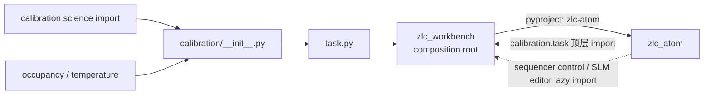
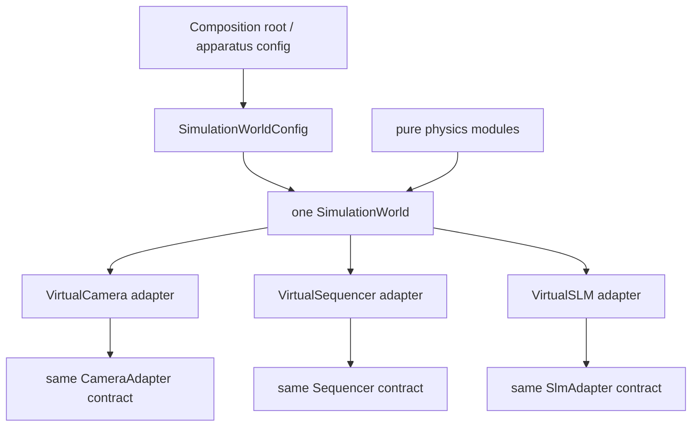

# Step 6-C：`zlc_atom` 剩余 source / tests / docs / metadata 全量只读审计

状态：完成（只读审计；仅新增本报告，不修改 production、tests、旧文档或硬件）
审计基线：`92089f5fc037f8a87e8efe834ccf83139aaf4383`
范围：`zlc_atom` 的 authoring、data bridge、execution、install、logic framework、Calibration science/artifact/report、Occupancy、Scan/Stepped/Seamless/Temperature、SimulationWorld，以及 package tests、fixtures、notebook、README/docs/GOAL、`pyproject.toml`。
排除重复：camera acquisition 细节见 `04b`，pulse 播放语义见 `04a/04c`，SLM 细节见 `05a/05b/05c`，live publication/copy/coverage 见 `03a/03b/03c`，plot/overlay/selector 见 `02`。本报告只在这些实现与其余 Atom 边界相交时引用结论。

裁决词：`KEEP`、`REDESIGN`、`DELETE`、`PASS WITH DEBT`、`USER DECISION`。优先级中 P0 表示可能泄漏资源、使独立安装不可用或使持久结果失真；P1 表示下一轮结构重构前应处理；P2 表示局部债务。

## 1. 结论先行

`zlc_atom` 不是“全部重写”的对象。以下骨架有真实必要性，应保留：

- `AuthoringSchema` 的唯一投影入口；
- typed device capability、安装时 identity 去重、依赖序安装和反向 close；
- data-only `LogicNodeDescriptor`、自动 leaf discovery、统一 `NodeHost` 接口；
- Calibration 的 SiteMap / FrameContract / ReadoutModel、held-out readout 训练和一次性 site detection；
- Occupancy 复用 Calibration classifier；
- ScanPlan、两种执行引擎共享 dataset writer，Temperature 再复用 seamless acquisition；
- 一个 `SimulationWorld` 统一拥有虚拟物理状态，而不是每个虚拟设备各造一套答案。

但现在仍有三条架构级断裂和数条确定的数据/资源问题：

1. **Atom 反向依赖 Workbench。** `zlc_workbench -> zlc_atom` 是已声明依赖，Calibration task、sequencer control、SLM editor 又从 `zlc_atom -> zlc_workbench`。其中 Calibration 是模块顶层 import，导致仅想 import Calibration science、Occupancy 或 Temperature 也要求 Workbench。Atom metadata 没声明它，两份边界测试又恰好漏扫它。
2. **直接安装图允许重复 device key，且会泄漏设备。** 两个相同 key 的 factory 都执行，第二个覆盖第一个；`Installation.close()` 永远看不到第一个 leaf。
3. **source checkout 绿不代表 wheel 可用。** `pyproject.toml` 未打包 `nodes/scan/mot_field_template.json` 和 `temperature_template.json`；安装后的默认 scan/temperature resource 会缺失。
4. Calibration JSON 没有 `format/version`，读取不拒绝 duplicate key、NaN 或未知字段；阈值的 count/photoelectron 单位藏在可选 `report.run_record.request` 中，不在 `FrameContract`。
5. Calibration 的“边采边存”实现仍把每个完整 frame snapshot 留在内存，只为了结束后画 PNG。典型 `200 samples × 3 frames × 2048² × uint16` 仅 values 就约 **4.69 GiB**。
6. Temperature task 的 buffers 在 `__init__` 建一次，第二次 `execute()` 不清空；artifact 只保存 pooled curve，不保存已经发布的逐 repeat/site survival 与 validity，关 session 后科学观测消失。
7. Stepped scan 每抓一 shot 都重新物化 `self.plan.rows()` 只为取长度，额外复杂度为 O(R·S·P²)；device scan 轴又因 `AuthoringField` 没有 unit 而永久无单位，Stop/失败也不会恢复已 tune 的设备。
8. 通用 install graph 硬编码 import `SimulationWorld`；shared-world 配置寄生在 `camera.virtual` 字段里，而绝大多数物理参数是 `SimulationWorld` 上的 public mutable 常量。owner 不正确。
9. 多个 `frozen=True` dataclass 内仍放普通 dict/list/可写 NumPy array；“冻结”只冻结属性重绑，不冻结科学 truth。
10. framework 已积累多项无真实 consumer 的预留面：`resolve_outputs`、`DeviceAccess.OBSERVE`、`DatasetInputSpec.required`、可空 preview kind；camera 唯一 dynamic preview 实际永远返回同一个静态声明。
11. `usage.ipynb` 已无法按保存代码运行，而所谓“matches usage notebook”测试没有读取或执行 notebook；dependency/import guards 也明确 false-green。

总体裁决：`KEEP scientific/runtime core + P0 boundary fixes + REDESIGN artifact/config ownership + DELETE confirmed dead seams`。

## 2. 已复现的隔离证据

### 2.1 反向依赖不是概念争论，而是 standalone import 失败

依赖方向实际是：



在 import hook 中只屏蔽 `zlc_workbench`、保留当前其余 checkout 后，三个本应可独立使用的入口结果为：

```text
zlc_atom.nodes.calibration.calibration -> ModuleNotFoundError blocked zlc_workbench...
zlc_atom.nodes.occupancy.processor     -> ModuleNotFoundError blocked zlc_workbench...
zlc_atom.nodes.temperature.task       -> ModuleNotFoundError blocked zlc_workbench...
```

原因不是这些文件自己都需要 Workbench，而是 Python 在载入子模块前先执行包的 `__init__.py`：

- `nodes/calibration/__init__.py` eager import `logic_node` 和 `task`；
- `task.py` 顶层 import `zlc_workbench.panel_save`、`panel_state`；
- `nodes/occupancy/__init__.py` 又 eager import `overlay`，把 `zlc_plot` 拉进纯 classifier 路径；
- Temperature 用 `from zlc_atom.nodes.calibration import ...` 和 `from ...occupancy import ...`，因此两条副作用全部继承。

`packages/zlc_workbench/pyproject.toml` 明确依赖 `zlc-atom`，而 `zlc_atom/pyproject.toml` 不声明 `zlc-workbench`。即便把后者补进 metadata，也只会把错误的环写实，不能修复层级。

### 2.2 重复 `DeviceSpec.key` 会真实泄漏 leaf

用两个无硬件 synthetic descriptors，二者 `DeviceSpec.key == "same"`，factory 分别记录创建/close：

```text
made=[0, 1]
installed_keys=('same',)
closed_after_installation_close=[1]
```

两个 factory 都成功；`installed[spec.key] = leaf` 静默覆盖第一个；最终只有第二个 close。`InstallationConfig` 路径会拒绝 duplicate `instance_id`，但 `create_installation()` 的公开 `DeviceSpec`/dict/list 路径绕过该不变量。裁决：`P0 REDESIGN`，在任何 factory 执行前拒绝 duplicate key。

### 2.3 Calibration codec 接受未知字段和非有限 JSON truth

用最小合法 `TrapCalibration.to_dict()`，加入顶层和 `site_map` 未知键，并令 `report.bad = NaN`，直接 `TrapCalibration.from_dict` 的结果是：

```text
extra_top_and_nested_accepted=1
nonfinite_report_preserved=True
```

`save()` 经 `write_readable_json` 会拒绝自己写 NaN，这是好事；但 `load()` 使用普通 `json.loads`，会接受手改/旧工具写出的 `NaN`，duplicate key 取最后一个，`TrapCalibration.from_dict`/`SiteMap.from_dict` 又忽略未知键。它比 installation JSON、SLM target JSON 的严格度低一个层级。

### 2.4 一个额外的 Stepped Scan O(P²) 热点

`SteppedScanMeasurement._capture_shot()` 每次执行 `len(self.plan.rows())`。100×100、即 P=10,000 的 plan：

```text
1 次 rows()     0.00086 s
100 次 rows()   0.04335 s
```

单次不大，但 10,000 shots 会额外重建同一个 10,000-row tuple 10,000 次，约 4 秒级纯 Python 工作和大量短命 tuple；而 `execute()` 已经有局部变量 `rows`。03a 已量化 growing scan snapshot 的全量 freeze/copy，这里是另一条独立的二次复杂度。

## 3. P0/P1 问题账本

| ID | 优先级 | 事实 | 裁决 |
|---|---:|---|---|
| ATOM-001 | P0 architecture/install | Calibration task 顶层反向 import Workbench；subpackage eager imports 将问题扩散到 science/Occupancy/Temperature；metadata 和 guard 都漏报 | `REDESIGN`：Atom 只产 typed report/sample payload；保存 panel/打开 host 由 composition adapter 注入或移到上层。subpackage facade 必须无副作用。 |
| ATOM-002 | P0 resource safety | `create_installation` 不拒绝 duplicate key，先建 leaf 被 dict 覆盖且不 close | `FIX FIRST`：normalize 后、world/factory 前检查 key 唯一。补创建数与 close 数守卫。 |
| ATOM-003 | P0 packaging | package-data 仅列 calibration JSON 和 SLM profiles，漏列 scan 两个模板 | `FIX FIRST`：打包 `zlc_atom.nodes.scan = ["*.json"]`，并用真正 build/install wheel 的 test 读取三份 resource。 |
| ATOM-004 | P1 artifact | Calibration artifact 无 format/version/strict reader；字段 exactness 与 semantic invariants 不完整 | `REDESIGN` 为 versioned strict codec；不要只把 codec id 写在 descriptor 外面。 |
| ATOM-005 | P1 scientific SSOT | count/photoelectron unit 只从可选 report 深层猜，缺失默认 counts；`FrameContract` 不存 value unit | `REDESIGN`：unit 是 FrameContract/ReadoutModel 的必填 truth；旧 artifact 缺失时明确 migration/refusal，不能默认为 counts。 |
| ATOM-006 | P1 memory/durability | `SampleWriter` 持有全部 full-frame snapshots；replay 不验编号连续、同 run、同 schema/shape | `REDESIGN`：采集只落盘；结束后逐个重读并画图；写 manifest/digest，replay 全量交叉校验。 |
| ATOM-007 | P1 lifecycle/data loss | Temperature 重跑不 reset buffers；artifact 丢逐 shot/site survival 与 validity | `REDESIGN`，并需用户决定 artifact 是 summary 还是完整 science result。 |
| ATOM-008 | P1 scan semantics | device scan 无 unit；Stepped 完成/Stop/失败留下最后 tune 值；settle 用不可取消 sleep；另有 rows O(P²) | `REDESIGN`；restore policy 需用户裁决。 |
| ATOM-009 | P1 layer boundary | generic install graph import concrete simulation；world config 由 camera leaf 代持 | `REDESIGN`：composition root/world provider 创建 shared backend；设备只引用它。 |
| ATOM-010 | P1 concurrency/lifecycle | `SimulationWorld.fire` 持 world lock 调 external camera methods；camera 只有 register 无 unregister | `REDESIGN`：锁内形成 immutable event batch，锁外投递；注册返回可释放 handle。 |
| ATOM-011 | P1 truth mutation | frozen dataclasses 持 mutable mapping/arrays：capabilities、config parameters、SiteMap.topology、reports、AtomDetection、PerSiteConfusion | `REDESIGN` 为 deep-owned immutable values；至少 MappingProxy + recursive plain copy + immutable ndarray bytes。 |
| ATOM-012 | P1 dead seams | `resolve_outputs` 零 leaf；OBSERVE 零 requirement；DatasetInput.required 无执行语义；dynamic preview 唯一用户恒定 | `DELETE`，有第二个真实需求再加。 |
| ATOM-013 | P1 false green | dependency/import tests 硬编码漏 `zlc_workbench`；notebook 测试不读 notebook；source tests 不装 wheel | `REDESIGN tests`。 |
| ATOM-014 | P2 discovery | device discovery 把任意 `Exception` 都翻译成“vendor unavailable”，可掩盖 built-in plugin 编程错误 | `REDESIGN`：已知 optional-load 错误可隔离，unexpected error 在 CI/diagnostic mode 失败；UI仍显示完整原因。 |

## 4. foundation / authoring / data / execution 逐文件裁决

### 4.1 顶层与 authoring

| 文件/符号 | 裁决 | 依据与具体改向 |
|---|---|---|
| `zlc_atom/__init__.py` | `KEEP` | 仅 `__version__`，没有 discovery/UI side effect；`docs/contract.md` 与它一致。版本 SSOT 问题归入 06e 的产品打包裁决。 |
| `devices/__init__.py` | `KEEP` | 空 facade 正确。 |
| `authoring.py::_typed_equal`、`_project_integer` | `KEEP` | 避免 bool/int 混同和 `int(1.2)` 式有损转换，测试覆盖有价值。 |
| `AuthoringChoice` | `KEEP WITH DEBT` | label/唯一 typed value 校验正确；“hashable”不等于深 immutable，但当前值均为 scalar/enum text。 |
| `AuthoringField` | `REDESIGN` | `enabled_when` 只验 controller 非空，不验 controller 确实存在、enabling values 属于 controller domain；`value_type` 直到第一次 projection 才发现拼错；缺 `unit` 使 device scan axes 丢单位。 |
| `AuthoringSchema.__post_init__` | `REDESIGN` | 应在 schema 构造时校验 enabled graph、支持的 value_type，并投影一次 defaults；现在错误 descriptor 可 discovery 成功、Start 时才失败。 |
| `AuthoringSchema.project_values` | `KEEP` | 未知字段、required、choice、bounds、custom validator 的唯一入口清晰。 |
| `_project_value(pair)` | `PASS WITH DEBT` | 返回 mutable list，而其他 domain types 返回 scalar；这会渗入 frozen config。推荐 canonical tuple，序列化时再 list。 |

这里不建议把 schema 发展成万能表单 DSL。只补当前真实 domain facts：类型、unit、enabled controller；不要增加没有第二个 consumer 的 conditional visibility/derived field 元机制。

### 4.2 `data.py`

| 符号 | 裁决 | 依据 |
|---|---|---|
| `cell_axis_id` | `KEEP` | producer/signal/role 到稳定 AxisId 的单一拼法。 |
| `snapshot_from_array` | `KEEP + REDESIGN` | 它是 Atom array 到 `zlc_data` 的真实唯一桥，schema cache 有实测价值；但 one-PointColumn 限制、dense full-shape validity、producer-prefixed axis identity 和 live 全量重建问题已在 03a/06a 展开。本报告不重复。 |
| `_SCHEMA_CACHE` | `KEEP WITH BOUND` | lock 与 128 LRU 容量合理；cache 是 process-global，测试应证明 explicit metadata 的 equality/hash 安全。 |

### 4.3 execution

| 文件/类/函数 | 裁决 | 依据与改向 |
|---|---|---|
| `execution/resources.py::ResourceKey` | `KEEP` | 小、严格、作为 logical resource identity 有真实使用。 |
| `PhysicalDeviceIdentity` / `DeviceBindingStamp` | `KEEP` | 区分 hardware readback 与 installation assertion，并给每次 binding 唯一 stamp，能拒绝同一物理设备重复绑定。 |
| `execution/ports.py::IdentityProof` | `KEEP` | broker-minted、single-use 的 guard 被真实测试覆盖。 |
| `DeviceBroker.verify_identity/bind/verify_capability` | `KEEP WITH DEBT` | 安装时不变量有价值；但 capability mappings 是 shallow mutable snapshot，broker 无 release。默认每次 Installation 新 broker，因此无 release 目前不是 leak；若继续保留 public broker injection，要定义 rebind 生命周期。 |
| `bind_verified_device` | `KEEP` | 消除各 leaf 重抄三步 protocol。 |
| `execution/capabilities.py` | `REDESIGN` | capability→type 表应保留；但 import `zlc_atom.devices.camera.contract` 会先执行 `camera/__init__.py`，后者 eager import DCAM/Pylon。foundation 因此间接加载具体硬件 family。把 contract 放在不触发 concrete facade 的模块，或让 camera package `__init__` 只导出 contract。 |
| capability `camera.working_point` | `DELETE` | 它是 bind 时的一次 snapshot；真实 nodes 全部调用 `camera.working_point()` 取得运行时值，仓内无 capability consumer。设备 tune 后 capability 立即陈旧。 |

`CapabilityProof.snapshot`、`BoundDevice.capabilities`、`InstalledLeaf.capabilities` 应指向同一 immutable mapping value，而不是三份普通 dict。当前安装时验证过的 mapping 之后仍可被 caller 改写，类型证明随之失效。

## 5. install / discovery / framework 逐符号裁决

### 5.1 安装配置与图

| 文件/符号 | 裁决 | 依据与改向 |
|---|---|---|
| `install/configuration.py::_text/_plain` | `KEEP` | installation JSON exact keys、duplicate key、NaN、plain-data 校验明显优于 Calibration codec。可作为统一 strict codec 参照。 |
| `DeviceInstanceConfig` | `KEEP + DEEP FREEZE` | instance/type/role 需要；`parameters` 经过 plain projection 但 nested dict/list 仍 mutable。`to_dict` 也只浅 copy。 |
| `InstallationConfig` | `KEEP` | duplicate instance_id 和 role 拒绝正确。`role` 只服务设备管理/唯一性，`.specs()` 后不进入 runtime；应明确它是 authoring identity，不是假装 runtime selector。 |
| `save/load_installation_config` | `KEEP` | atomic save、strict read、format discriminator 都正确。缺显式 version 可在真正迁移字段时再加；当前 exact schema + format 足以判别 v1。 |
| `install/descriptors.py::DeviceTypeDescriptor` | `KEEP + NARROW` | leaf-owned schema/factory/capabilities/discover/control 是正确插件表。`world_config: Callable -> object` 是 backend-specific escape hatch，已让 generic graph 知道 Simulation 类型，应移出通用 descriptor或改为 composition-owned provider token。 |
| `InstalledLeaf.close` | `KEEP` | leaf-owned closer 必需；capabilities mapping 需 immutable。 |
| `InstallationFactoryContext` | `KEEP` | world/broker/already-installed/connect_pulse 足够窄；`devices` mapping 同样应只读。 |
| `install/graph.py::DeviceSpec` | `KEEP + VALIDATE` | 是 programmatic composition 的必要入口；必须在 `create_installation` 验 key 唯一，config 深冻结。 |
| `_topological` | `KEEP WITH LIMIT` | type-level dependencies 满足现有 family；如果未来一个 leaf 必须依赖某个具体 instance，现协议表达不了。没有真实需求前不要先造 instance-edge DSL。 |
| `_world_from_apparatus` | `MOVE/REDESIGN` | generic install glue直接 import `SimulationWorld/Config` 并作 `isinstance`，违背 foundation→concrete 单向边界。`None` 同时表示“贡献默认 world”和“没有 config”，语义含混。 |
| `create_installation` | `KEEP + P0 FIX` | isolate independent leaf failures、dependency failure、startup cleanup、reverse close 都必要；先检查 duplicate key。不要 catch `BaseException` 当普通 startup failure，`KeyboardInterrupt/SystemExit` 不应变成 `Installation.failures`。 |
| `Installation.close` | `PASS WITH DEBT` | 只有全部 close 成功才 terminal，失败可重试，这一行为已有守卫；重试会再次 close 已成功 leaf，因此 closer 的幂等要求必须写成契约。 |
| `tunable_devices` | `KEEP` | duck-typed optional scan surface 有真实 camera consumer；返回值可用。未来应让 `tunable_fields()` 返回带 unit 的专门 value，而不是借 AuthoringField。 |
| `install/templates.py` | `KEEP` | `virtual/hardware` 是 composition convenience，不是 device registry。模板可固定；新增 device 不应被迫修改它。 |

### 5.2 discovery

| 文件/符号 | 裁决 | 依据 |
|---|---|---|
| `_modules()` 的 `rglob(device_types.py)` | `KEEP` | synthetic leaf test 证明添加 leaf 不改 graph。当前封闭 built-in plugin 模型符合项目，不需要第三方 entry point。 |
| `_walk()` import isolation | `REDESIGN` | vendor DLL import 失败确实应显示为 unavailable；但任意 `Exception`（包括 descriptor module 的 NameError/bug）都被降格成“本机不可用”，CI 与操作台可 false-green。提供 strict diagnostic mode，或只隔离明确 optional dependency/load error。 |
| `DeviceCatalogSnapshot` / `UnavailableDeviceTypes` | `KEEP` | 一次 indivisible catalog 与人类可读 reason 有必要。 |

### 5.3 logic framework

| 文件/类/函数 | 裁决 | 依据与改向 |
|---|---|---|
| `DatasetInputSpec` | `KEEP MINIMAL` | name/contract matching 真实使用；`required` 没有 optional-dataset execution path，所有 dataset node 都被 Workbench 当 source_required，删字段。 |
| `ArtifactCodec` / `ArtifactInputSpec` | `KEEP` | arbitrary saved artifact 与 typed decode 是真实边界；Calibration codec 自身需严格。 |
| `WorkspaceResourceSpec` | `KEEP` | 它与 ArtifactInput 看似相似，但目录受 workspace 管理、值来自 authoring field，生命周期不同；不应仅为少几行强并。可统一底层 strict file resolver。 |
| `ResolvedArtifact` / `ResolvedWorkspaceResource` | `PASS WITH DEBT` | shape 完全相同但 semantic type check 在各 `_build` 使用。保留能防错，代价很小。 |
| `OutputSpec` / `ArtifactOutputSpec` / `NodePreviewSpec` | `KEEP` | static output、artifact path、默认 preview 是 operator contract。当前所有 preview 都写非空 plot kind，空字符串推断分支无真实 consumer，可删。 |
| `DeviceAccess` | `DELETE OBSERVE` | 全仓 requirement 都是 `EXCLUSIVE`；`OBSERVE` 为零。若运行时暂时只有 exclusive claim，连 `access` 字段都可先去掉。 |
| `SelectionMapping` | `KEEP` | camera ROI 与 scan range 两组真实 consumer；02 已审 selector/overlay 细节。 |
| `LogicNodeDescriptor.__post_init__` | `KEEP + PRUNE` | namespace collision、resource/schema 对齐、processor 恰一 dataset、output/preview 合法性是有价值的 build-time guards；删除无 consumer 分支会显著缩短它。 |
| `resolve_outputs` / `outputs_for` 动态分支 | `DELETE` | 当前七个 leaf 零 `resolve_outputs`；所有 output contract 静态。Workbench 可直接读 outputs，或保留一个只返回 static tuple 的兼容 method 后再删。 |
| `resolve_node_previews` | `DELETE` | 唯一用户 `_frames_preview(_values)` 无视 values，永远返回 `frames/facet_grid`；改成 `node_previews=(...)`。 |
| `ui_contributions: tuple[object]` | `REDESIGN` | 三个 scan/temperature consumer 都是 callable factory；descriptor 却不验证。把当前事实写成 callable contract，不要保留任意 object。 |
| `resolve_field_availability` | `KEEP` | Calibration/Camera 对 photoelectron capability 的设备相关可用性有真实 consumer。 |
| `_framework/discovery.py` | `KEEP` | leaf-derived logic catalog 正确；但当前 eager package side effects 使 discovery 间接依赖 Workbench，修 facade 后才能真正 headless。 |
| `nodes/__init__.py` 三个 `*_template_bytes` | `KEEP` | composition seeding 的单一 packaged-resource入口；正因有真实 consumer，漏 package-data 是 P0。 |

## 6. Calibration：逐文件、类与算法簇裁决

### 6.1 文件级

| 文件 | 裁决 | 说明 |
|---|---|---|
| `calibration/artifact.py` | `KEEP + FIX CONTRACT` | 18 行 codec adapter 很合适；contract id 叫 `calibration.readout.v1`，文件内部却没有任何 format/version，二者目前不是同一 truth。 |
| `calibration/bimodal.py` | `KEEP CORE + DELETE DEAD` | Gaussian overlap、multi-start two-state EM、held-out per-site confusion 是单一 science owner；`gaussian()` 和 `confidence_weighted_fidelity()` 全仓无调用，确认删除。`PerSiteConfusion` arrays 需 immutable。 |
| `calibration/psf.py` | `KEEP` | normalized kernel、Gaussian convenience、window extraction 小且单责；public export 可缩，函数本身被 Calibration 使用。 |
| `calibration/calibration.py`（2276 行） | `SPLIT BY PURE RESPONSIBILITY` | 不是因为行数机械拆，而是同时拥有 artifact domain、JSON codec、feature extraction、site detector、PSF measurement、classifier training、diagnostic report。建议仍在同 package 内拆 `model.py`、`codec.py`、`site_detection.py`、`readout_training.py`；禁止第二份 science 实现。 |
| `calibration/outputs.py` | `KEEP` | calibration cycle 到 typed snapshot、live preview slot 是真实独立职责；live freeze/copy 裁决见 03a。 |
| `calibration/summary.py` | `KEEP + STRICTEN` | summary 与人类 log 真实需要；`_plain` 对未知对象直接 `str(value)` 会把新类型静默变成不可重放文本，应拒绝 unsupported type。 |
| `calibration/task.py`（1347 行） | `SPLIT/REDESIGN` | 同时做 acquisition orchestration、sample archive、replay、run record、artifact save、6 张图 rendering、Workbench panel integration。Task 保留 orchestrator；sample store/replay manifest 与 report renderer 分开。 |
| `calibration/logic_node.py` | `KEEP` | schema、devices、resource、preview、artifact declaration 属 leaf；`_build` 明确校验 ResolvedResource。 |
| `calibration/pulse.py` / `imaging_template.json` | `CROSS-REF 04a/04c` | pulse resolver、forever fire、target equality/RepeatRegion 等不在本阶段重复。模板已被 package-data 正确列入。 |
| `calibration/__init__.py` | `REDESIGN NOW` | 30+ exports 且 eager import task/logic/math，是 reverse dependency 扩散器。science consumers 应从轻量明确模块 import；subpackage facade 只导出稳定 domain types，task/LOGIC_NODE 显式路径或 lazy。 |

### 6.2 Domain value 与 codec

| 类/函数 | 裁决 | 具体问题 |
|---|---|---|
| `FrameContract` | `KEEP + ADD VALUE UNIT` | shape/sensor/ROI/binning/exposure 校验正确；缺 frame numeric unit（count/photoelectron），dtype 也未记录。关键 threshold unit 不能靠 report 猜。 |
| `reads_photoelectrons` | `DELETE AFTER MIGRATION` | 现在从 `report.run_record.request.photoelectrons` 深层取值，任一层缺失即默认为 False。这把兼容猜测当科学 truth；迁移到 `FrameContract.value_unit` 后删除。 |
| `AtomDetection` | `KEEP + IMMUTABLE` | named result 比裸 tuple 好；`np.asarray` 不 copy、不 set read-only，caller 改输入可改 frozen result。 |
| `SiteMap` | `KEEP + DEEP FREEZE` | centers/validity/quality 已 owned immutable；`topology` 只浅 dict。`from_dict` 应 exact keys，valid site 的关键 quality policy需明确。 |
| `ReadoutModel` | `KEEP + STRONGER INVARIANTS` | kind-specific shape checks好；但 `usable_sites=True` 仍可配 NaN threshold，PSF weights 不验 finite/非零归一尺度，也没有声明它们是否允许 signed matched-filter lobes；boxes 不与 FrameContract/site centers交叉检查。损坏 artifact 可成功 load、运行时才退成 invalid。 |
| `TrapCalibration` | `KEEP + VERSIONED CODEC` | model/site id 对齐、kind唯一/order/default 正确；`report` shallow mutable，`to_dict/from_dict/load` 不严格。 |
| `CalibrationResult` | `KEEP INTERNAL + FREEZE REPORT` | calibration 与 full diagnostics 区分合理；report mapping/array graph 可变。 |
| top-level `signals(calibration,...)` / `detect(calibration,...)` | `DELETE` | 纯 delegate，仓内/测试零 consumer；methods 是唯一实现。 |
| `readout_model_kind_from_choice` | `KEEP` | 将 UI `default` 与 artifact default 清楚分开。 |

建议的 Calibration artifact v2 至少包含：

```text
format/version
algorithm_id + algorithm parameters (含 train_fraction/split_seed)
frame_contract (含 value_unit)
site_map
readout_models
run_record / source manifest digest
```

不要把大 diagnostics 全塞进 deployment calibration JSON。可分为：小而严格的 deployable calibration + 完整 run/report archive；二者通过 digest/run id 相连。当前 `CalibrationRunResult` 同时持 capture/reference/short/report/pulse/run/summary，恰说明这两个产物概念已存在，只是没有正式边界。

### 6.3 Site detection / readout training 算法簇

| 符号簇 | 裁决 | 审查结论 |
|---|---|---|
| `extract_box_signals`、`extract_psf_signals`、`classify_threshold` | `KEEP` | Occupancy/Feedback/Calibration 共用同一实现，没有第二份 runtime science。`extract_psf_window` 仍是唯一核心。 |
| `_accumulate_run` → `_admission_thresholds` → `_candidate_peaks` → `_place_candidates` → `detect_sites` | `KEEP, SPLIT MODULE` | hit 与 average 双证据、interleaved half repeat check、border measurability、valley/saddle 去重都有明确测试和 domain 理由。没有隐藏固定 5×7/site count；不应因复杂就改成 grid guessing。 |
| `_fit_gaussian_spot_2d` | `REDESIGN ERROR BOUNDARY` | `except Exception` 将 programming error、shape bug、SciPy bug全部伪装成 centroid fallback。只捕获预期 numerical convergence/value errors，并在 diagnostics 记录失败原因。 |
| `_measure_readout_weights` | `KEEP` | 用 long-frame loaded-minus-empty 测 matched filter、uniform fallback，且 train mask 不用 held-out labels，设计合理。 |
| `_seeded_train_test` / `_train_readout_model` | `KEEP + RECORD CONFIG` | per-site/state deterministic split 与 held-out confusion 正确；`train_fraction=0.9`、`seed=0`虽可参数化，却不在 CalibrationRequest/run artifact 中。重放同 frames 不能知道旧 run 用了什么。 |
| `calibrate` | `KEEP ORCHESTRATOR, SPLIT HELPERS` | 它作为唯一 pipeline 入口必要；当前返回 deploy calibration + huge diagnostic mapping合理，但 300 行 orchestration和多份 loosely typed report key 需要 typed internal result或至少集中 schema。 |
| `bimodal.fit_bimodal` / `per_site_fidelity` | `KEEP` | known-truth、mutation guards 有效覆盖方向/阈值/held-out confusion。 |

### 6.4 Acquisition、sample 与报告

| 类/函数 | 裁决 | 具体问题 |
|---|---|---|
| `CalibrationRequest` | `KEEP` | 协议和分析参数集中、校验充分；notebook 仍传已删除的 `roi_xywh/detection_min_distance`，是 notebook 错，不是 Request 应迁回。 |
| `CalibrationCapture` | `KEEP` | 明确三帧 cycle 与 terminal proof；derived `reference/short` 避免重复储存。 |
| `CalibrationRunResult` | `KEEP INTERNAL + IMMUTABILITY` | artifact与report consumers需要；多个 mapping浅 copy、frame records tuple内 arrays依赖其自身 immutability。 |
| `SampleWriter.write` | `KEEP DURABLE INTENT` | 每个 sample 在下一次采集前写 NPZ，取消/分析失败仍留证据，正确。 |
| `SampleWriter._samples` / `render` | `REDESIGN` | 为结束后画图保留全部 `OwnedSnapshot`。应只留 path/index；camera结束后按序逐文件 `read_archive/read_dataset`、画完释放。 |
| `read_saved_samples` | `REDESIGN STRICT MANIFEST` | glob+lexical sort 后用 enumerate 重新造 ordinal；不验 filename index gap/duplicate、每个 archive 的 schema/shape/run_chain、所有 run_record 相等，也不拒绝混入另一 run。 |
| `_save_report` | `KEEP` | 先写 numbers、后画图，renderer失败不应抹掉测量；但需用 durable writer 写 summary.txt，且明确 partial report状态。 |
| `_save_report_images` | `KEEP PRODUCT FEATURE, MOVE ADAPTER` | 从同一 in-memory `CalibrationResult` 画图，没有重算 science；但 228 行 presentation 不应与 acquisition task 同文件。 |
| `_sample_host` + Workbench panel imports | `MOVE OUT OF ATOM` | 这是 ATOM-001 的直接源头。若 figure archive 是跨应用格式，其 writer/renderer contract 应在 data/plot 层；Atom 不应 import composition root。 |
| `CalibrationTask._run` | `KEEP ORCHESTRATION, SPLIT SERVICES` | reset `_actual_working_point/_result`、try-safe、live preview、single analysis/save flow正确；函数同时创建路径、采集/重放、render、分析、保存、summary，属 God orchestration。 |

## 7. Occupancy 逐文件裁决

| 文件/符号 | 裁决 | 说明 |
|---|---|---|
| `occupancy/processor.py::OccupancyProcessor` | `KEEP` | 运行时 classifier 唯一复用 `TrapCalibration.signals`，再比较 threshold；没有第二份 box/PSF science。ROI rebasing 与 source schema检查有必要。 |
| `_validate_source_run_record` | `KEEP + UNIT FIX` | sensor/binning/ROI结构验证清楚；unit check 仍依赖 `calibration.report` 深层 optional flag，见 ATOM-005。exposure mismatch 当前只记录不拒绝，是明确 physics policy，需用户确认。 |
| `process` | `KEEP WITH DATA-MODEL LIMIT` | counts只提取一次再 classify，避免双做 PSF；但只接受恰一个 PointColumn，因而不能直接处理含 source+scan columns 的 finished scan。根因和统一方案见 03a/06a。 |
| `evaluate` / `_live_outputs` | `KEEP` | source run record先 rebase，再同 generation/revision 派生；publication/coverage细节见03。 |
| `OccupancyResult` | `REDESIGN IMMUTABILITY` | arrays 仅 `np.asarray` 后 setflags，可能冻结 caller 所持 array；`artifacts` 是普通 dict。应 own copy/immutable bytes。 |
| `inherited_stamps` | `KEEP PRIVATE` | 只有本模块 `evaluate` 使用，doc称 public但未导出；改 `_inherited_stamps`，不需要扩 public API。 |
| `frame_judged` | `USER DECISION / CROSS-REF 02` | 与 parent frames 数值重复，是为同 derived publication 的 image+overlay evidence；当前又复制完整 frame。02 已审 overlay联动。推荐用明确 lineage/alias-safe snapshot，而不是第二份 bytes；不要在本报告另造 overlay协议。 |
| `occupancy/overlay.py` | `KEEP PRESENTATION ADAPTER, EXPLICIT IMPORT` | domain geometry→generic ImagePointOverlay 的转换真实需要；它 import `zlc_plot`，不应由 `occupancy/__init__.py` eager import到纯 classifier。其 same-shot/selector问题见02。 |
| `occupancy/logic_node.py` | `KEEP` | dataset+artifact inputs、五个 static outputs、model choice合理。 |
| `occupancy/__init__.py` | `REDESIGN` | eager import overlay和logic node导致 `from ...occupancy import OccupancyProcessor` 拉 plotting/framework；只导稳定 classifier domain，overlay/LOGIC_NODE显式路径或 lazy。 |

## 8. Scan / Stepped / Seamless / Temperature 逐文件裁决

### 8.1 Scan common library

| 文件/符号 | 裁决 | 说明 |
|---|---|---|
| `scan/plan.py::ScanPort` | `KEEP + UNIT OWNER FIX` | finite bounds正确；device port的 unit被强制空字符串。需要 unit-bearing TunableField，而非从字段名猜。 |
| `ScanAxis` / `ScanPlan` | `KEEP` | ordered axes、last-fastest rows、point_count是清楚唯一模型。`from_tree` 应拒绝未知字段/错误 entry shape；现在 typo key可静默忽略。若 plan成为独立文件，再加 format/version；当前是 authored draft可先 exact keys。 |
| `scan_ports_for` | `KEEP` | pulse API→hard-bounded port单一投影；实际 tick alignment/metadata差异见04a。 |
| `scan_ports_for_devices` | `REDESIGN RETURN TYPE` | duck typing真实需要；应验证返回项类型/field name uniqueness并携带 unit。 |
| `bind_plan` | `KEEP + VALIDATE DUP PORTS` | before-hardware range check正确；`by_name` 对 duplicate offered ports last-wins，建议先拒绝。 |
| `load_scan_template` / `plan_from_authored` | `KEEP + STRICT JSON` | one resolver必要；普通 `json.loads` 的 duplicate/nonfinite policy应与 pulse/installation统一，04a已有更完整 codec裁决。 |
| `SCAN_PLAN_SELECTIONS/_selected_plan` | `KEEP` | scan plot selection→same point count narrowed range是唯一实现；细节见02。 |
| `scan/editor.py` | `KEEP UI LEAF + FIX CLAIMS` | 三个节点真实复用，一份 editor正确。invalid plan被吞成空表，operator看不到原错误；summary固定说“each point resolves the template”，对 Seamless/Temperature不实。展示应只陈述 plan facts，不描述执行引擎。 |
| `scan/dataset.py::scan_dataset_schema/Writer/LiveSlot` | `KEEP + CROSS-REF` | 两执行引擎共享schema/writer是正确抽取；repeat压平物理语义见04a/04c，live全量copy见03a。不要再建第三份 Temperature writer。 |
| `scan/source.py::check_cancelled/wait_for_board` | `KEEP` | 两引擎共享可取消 wait是真正第二consumer抽取。 |
| `PublishedSignalSource` | `KEEP CURRENTLY, REDESIGN CAUSALITY` | generation guard/follow tap有用；publication与played row无法证明一一对应，详见04a/04c。 |
| `scan/seamless.py::SeamlessScanMeasurement` | `KEEP + CANCELLABLE SETTLE` | Temperature是第二consumer，放common而非`seamless_scan` node package正确。它与Stepped一样用一次不可取消 `time.sleep(settle_seconds)`；pulse/row/shot问题见04c。 |
| `scan/__init__.py` | `KEEP WITH LAZY UI` | 当前未 import editor，common library facade尚可；exports略宽但都有至少一个真实consumer。 |
| `mot_field_template.json` / `temperature_template.json` | `KEEP + PACKAGE` | 正式默认resource；pyproject漏打包。pulse物理语义见04。 |

### 8.2 Stepped 与 Seamless leaf

| 文件/类/函数 | 裁决 | 说明 |
|---|---|---|
| `stepped_scan/measurement.py::SteppedScanMeasurement` | `KEEP + FIX LIFECYCLE/PERF` | host-advanced device port是seamless无法替代的真实路径。`_capture_shot`改用已算的point_count；settle使用可取消wait。 |
| `_split_row/_api_values` | `KEEP` | port family决定执行owner，未scan pulse params保持authored nominal，清楚。 |
| `_apply` | `CROSS-REF 04c + DEVICE POLICY` | pulse repeat/target问题见04c；多device tune过程中若中途失败，已移动设备无rollback；结束也不restore。需要显式policy。 |
| `_collect` | `CROSS-REF 04c` | sw/pulse gating、duration、source association已审。 |
| `stepped_scan/logic_node.py` | `KEEP` | schema与source-live检查合理；与 seamless重复的五个字段是两个独立产品表单，当前未发生漂移，不建议为了少几十行造抽象schema factory。 |
| `seamless_scan/logic_node.py` | `KEEP` | 明确拒绝device port并指向 stepped；static preview和shared editor正确。 |
| 两个 package `__init__.py` | `KEEP` | 小 facade；Stepped额外export engine有真实直接测试，Seamless只export leaf form合理。 |

需要用户裁决的 device scan completion policy：

- **推荐 A：restore**。Start 前读取每个 tunable field，任何完成/Stop/失败都恢复；run record写 before/played/final。需要扩 tunable contract 的 readback。
- B：leave-at-last。适合“scan后就在最佳点继续”的工作流，但必须明确显示/记录 final applied values，Stop后也不能让 operator误以为回到了原点。

当前是未声明的 B，且没有 final readback evidence。

### 8.3 Temperature

| 文件/符号 | 裁决 | 说明 |
|---|---|---|
| `temperature/logic_node.py` | `KEEP` | calibration artifact + camera/sequencer exclusive + one t_off plan + curve preview职责清楚。 |
| `_editor_factory` | `KEEP` | 复用 ScanPlanEditor且只开放 t_off，比第二个 release-list parser正确。 |
| `TemperatureTask.__init__` | `REDESIGN STATE LIFETIME` | `_before/_after/_valid/_seen` 在construction分配；`execute`只改 generation，不 reset。NodeHost/直接caller重用同一task时旧seen与观测残留。每次execute创建run-local state。 |
| `_judge/_survival/_pooled` | `KEEP` | Occupancy负责逐帧judgement，Temperature只拥有 before/after pairing；eligible=seen & both valid & initially occupied，pooled按Bernoulli trials计数，science边界正确。 |
| `_seconds` | `KEEP + ACTUAL VALUE DEBT` | 使用 pulse package unit registry正确；authored value与tick-aligned实播差异见04。 |
| `_survival_snapshot/_rate_snapshot` | `KEEP` | per repeat/point/site和pooled one-repeat语义明确；live问题见03。 |
| `_run_record` | `KEEP` | 同时记录calibrated/current exposure、scan/camera/device names合理。 |
| artifact writer | `REDESIGN` | JSON只有 `format`、authored t_off、run_record/curve；已发布的 survival/validity arrays没有 durable home。format string含v1但无独立version尚可，关键是内容不足。 |
| `temperature/__init__.py` | `REDESIGN EAGER IMPORT` | task间接拉Calibration/Occupancy的WorkBench/plot副作用；先修下游facade。 |

Temperature artifact 推荐写一份 typed dataset/archive，至少包含：played/aligned t_off、`survival`、validity、pooled numerator/denominator、R/S/source repeat维度、run chain；JSON summary可以保留为旁车，不应是唯一结果。

## 9. SimulationWorld 与 virtual layer 边界

### 9.1 不应因 1202 行就拆掉唯一 state owner

`SimulationWorld` 同时拥有 SLM trap intensity、loading、qCMOS fluorescence、MOT response、release survival、pulse event routing。这些状态确实互相因果：phase改变trap depth，depth影响loading/brightness/survival，pulse edge改变atoms，camera看到当时状态。把它拆成互不知道的四个“虚拟设备答案”会重新产生非唯一 truth。

正确重构是：**保留一个 world/state owner，抽出纯数学策略**（optics propagation、release model、MOT renderer、qCMOS renderer），由 world 在锁内更新状态、在锁外执行昂贵计算/投递。不要把状态拆散。

### 9.2 逐文件/符号

| 文件/符号 | 裁决 | 说明 |
|---|---|---|
| `simulation/world.py::SimulationGeometry` | `KEEP` | grid/image/spacing与derived centers单一owner；但spacing没有authoring入口。 |
| `SimulationWorldConfig` | `EXPAND/REHOME` | 目前只 geometry/seed/MOT optimum；camera schema只实际提供grid/frame/seed，MOT optimum也无法author。应成为apparatus/backend config，不属于camera leaf。 |
| `SimulationWorld.__init__` | `KEEP OWNER, SPLIT POLICY` | 大量物理参数作为 public mutable attributes硬编码：conversion、noise、loading、atom rate、temperature、depth、waist等。测试直接改其中两项。全部进入 immutable config或明确 test scenario overlay。 |
| `_nominal_slm_command` | `KEEP WITH BOUND` | virtual physics复用真实solver避免第二份phase science；unbounded `lru_cache(maxsize=None)`对任意geometry是小债务。SLM算法见05。 |
| `apply_slm_phase/_ensure_slm_propagation` | `CROSS-REF 05` | 单一commanded phase/trap propagation路径正确；反馈truth问题见05。 |
| `_load_shot/_lose_atoms/render_frame/render_mot_frame/fire/safe` | `KEEP` | 因果链统一；04c已记录Virtual streamer会在fire内同步爆发frames。 |
| `fire` lock boundary | `REDESIGN` | 持 `RLock` 调 `camera.capture_state()`、`working_point()`、renderer/trigger等external methods，形成world→camera lock边；camera worker又可通过frame source进入world。应锁内生成event/state snapshot，锁外call devices。 |
| `register_camera` | `REDESIGN` | 只add、无unregister；closed camera仍被world强引用和遍历。返回registration handle，camera close/leaf close释放。 |
| public `detector_efficiency/site_psf_*/occupancy/fire_count/propagation_count/slm_phase_revision/release_survival` | `DELETE OR TEST-FIXTURE API` | production source无consumer，几乎只被测试当hidden oracle；它们使测试需求变成production surface。保留必要debug snapshot可集中为显式 `SimulationDiagnostics`，默认不作为device/domain API。 |
| `simulation/device_types.py` | `KEEP LEAVES + MOVE WORLD CREATION` | virtual devices走同factory/capability路径正确；`camera.virtual`独占shared geometry/seed authoring错误，其他leaf `world_config -> None`只是“请求默认world”的暗号。 |
| `simulation/camera.py/sequencer.py/slm.py` | `CROSS-REF 04/05` | 只审world registration/lifecycle；adapter、pulse cadence、SLM command细节已在前阶段。 |
| `simulation/__init__.py` | `PASS WITH DEBT` | eager re-export全套virtual types方便tests，但generic graph正因从这个facade import而加载整个concrete family。graph不应依赖它。 |

建议的 owner 关系：



generic `install.graph` 只接收已解析 backend context/provider，不 import W；camera/sequencer/SLM leaf也不以 `None` 约定谁创建 W。

## 10. Immutability / SSOT 横切裁决

以下对象写了 `frozen=True` 但内部 truth仍可变：

| 对象 | 当前可变内容 | 风险 |
|---|---|---|
| `DeviceInstanceConfig.parameters` | nested dict/list | config hash/equality/保存结果可在construction后变化。 |
| `DeviceSpec.config` | dict + nested values | world/factory看到的值可被外部并发改。 |
| `InstallationFactoryContext.devices` | mapping | factory可误改composition view。 |
| `CapabilityProof/BoundDevice/InstalledLeaf.capabilities` | dict | 验证后的capability type/value可被替换。 |
| `SiteMap.topology` | dict | site identity/拓扑可漂移。 |
| `TrapCalibration.report`、`CalibrationResult.report`、`CalibrationRunResult.*` | dict graph/ndarray | artifact、report、classifier unit truth可在save前后变化。 |
| `AtomDetection` / `PerSiteConfusion` | caller-owned writable arrays | frozen result随caller input变化。 |
| `OccupancyResult.artifacts` | dict | output name→snapshot可换。 |

统一规则应是：domain value在construction时 **own** 自己的 bytes，array用immutable buffer，plain mapping递归冻结；需要序列化时显式 `to_tree()` 产生新mutable tree。不要每个类各自决定“浅 dict 大概够”。

另有三个平行 truth：

1. `camera.working_point` capability snapshot vs camera实时 `working_point()`；删除前者。
2. Calibration unit in `report.run_record.request` vs frames/run parameters；移到 FrameContract。
3. Simulation geometry/physics in camera authoring、world defaults、test mutations；收敛到 SimulationWorldConfig。

## 11. 测试与 fixture 逐文件裁决

### 11.1 本阶段直接相关

| 测试/fixture | 裁决 | 覆盖价值与 false-green/缺口 |
|---|---|---|
| `tests/fakes.py` | `PRUNE` | `FakePlane`作为production plane instrumentation仍有用；`FakeNodeHost`、`FakePulseStreamer`只被`test_contract_fakes.py`测试自身，没有节点/production consumer，删除。`camera_cycle_snapshot`、`ScriptedScanBench`等被真实行为测试复用，应保留。 |
| `test_contract_fakes.py` | `DELETE/REPLACE` | 三个测试证明fake像fake，不证明production contract；尤其FakeNodeHost/PulseStreamer形成自证循环。production boundary test应对真实Protocol/adapter或让real tests消费fake。 |
| `test_declared_dependencies.py` | `REDESIGN` | `_DISTRIBUTION` 手写映射没有 `zlc_workbench`，也不扫PyQt/Pillow/Scipy等direct external imports；因此ATOM-001全绿。映射应由workspace package manifest/import metadata派生，至少未知 `zlc_*` import直接失败。 |
| `test_import_boundaries.py` | `REDESIGN` | `VIEW_ROOTS`没有`zlc_workbench`，且所有concrete node/device plugin都被允许import view root；只断言Calibration有zlc_plot，未限制composition-root reverse edge。应表达层DAG，而非“plugin一律开洞”。 |
| `test_installation_config.py` | `KEEP` | exact keys、roundtrip、duplicate id/role、duplicate JSON key/NaN、plain parameters均有价值；补 nested immutability。 |
| `test_installation_guards.py` | `KEEP + ADD P0 CASE` | close retry、synthetic discovery、capability type、catalog完整性好；缺 direct `DeviceSpec` duplicate key及其首leaf close计数。 |
| `test_installation_and_nodes.py` | `KEEP + RENAME FALSE CLAIM` | broad virtual composition/descriptor/node host integration有价值；`test_virtual_installation_auto_calibration_path_matches_usage_notebook`并不读取notebook，只重写了另一份已更新代码，名称造成false green。 |
| `test_device_configuration.py` | `KEEP + REVISE OWNER ASSERTION` | 禁止runtime/derived knobs进device authoring有价值；它明确断言只有virtual camera可有grid/seed，正把错误world owner锁死。改为world/apparatus config测试。 |
| `test_execution_safety.py` | `KEEP` | identity proof opaque/single-use有效；补capability deep immutability与broker injected lifetime（若保留）。 |
| `test_v3_architecture.py` | `REDESIGN` | AST import allow-list、descriptor smoke、failure safe有价值；当前allow-list显式祝福若干cross-node边，容易把临时结构变宪法，并未抓WorkBench reverse edge。pulse/calibration cadence断言见04。 |
| `test_calibration_saved_frames.py` | `KEEP + ADD CORRUPTION MATRIX` | 边到边写sample/重放/opt-in保存有价值；缺gap、混run、schema漂移、不同run_chain、invalid filename、全量内存守卫。 |
| `test_physics.py` | `KEEP` | public calibration dispatch、PSF kind、response invariant、box oracle是小而有效science guards。补usable threshold finite/PSF artifact invariants。 |
| `test_readout_against_known_truth.py` | `KEEP` | fixture truth→site detector→每model occupancy→threshold→PSF的高价值oracle。 |
| `test_site_detection.py` | `KEEP` | dim/rare/border/two-hills/coincidence覆盖与实现算法理由对应；应继续避免固定grid oracle。 |
| `test_mutation_guards.py` | `KEEP` | threshold移动、方向翻转、rate反转会红，能防“看似绿”的science inversion。 |
| `test_scan_plan.py` | `KEEP + ADD STRICT/PERF/UNIT` | nesting、roundtrip、bounds、device port projection好；缺unknown tree keys、duplicate offered port、device unit、large point_count不反复materialize。 |
| `test_stepped_scan_node.py` | `KEEP + CROSS-REF 04` | gating/repeat/settle/device tune/virtual optimum均是真行为；缺Stop during settle、multi-device partial tune、completion/Stop restore policy、O(P²) guard。 |
| `test_seamless_scan_node.py` | `KEEP + CROSS-REF 04` | reject device axis、table order、settle、planted release curve有价值；expected curve直接调用production `world.release_survival`，是同实现自证，不是独立physics oracle。 |
| `test_temperature_chain.py` | `KEEP BUT CURRENTLY FALSE-COMPLETE` | 唯一happy path证明live/final curve；它只断言summary JSON，反而把“artifact不保存survival data”锁成通过。补同task二次execute、cancel后重跑、artifact roundtrip恢复逐site数据。 |
| `test_virtual_physics.py` | `KEEP SCIENCE, SPLIT TEST API` | qCMOS/MOT/SLM/release/pulse因果覆盖很强；2542行混四个domain，且大量依赖production public hidden oracles或直接private attrs。按physics module拆tests，使用显式test diagnostics/独立analytical oracle。 |

### 11.2 已由前阶段详细覆盖、这里不重复判算法

| 测试 | 本阶段裁决 |
|---|---|
| `test_camera_and_execution.py`、`test_dcam_camera_adapter.py`、`test_pylon_camera.py`、`test_photoelectron_units.py`、`test_monitor_and_installation.py`、`test_hosted_nodes.py`、`test_repeated_runs.py`、`test_imaging_template_cadence.py`、`test_sequencer_contract.py` | `KEEP / 见03、04b、04c`；这里只补“camera.working_point capability无consumer”和facade eager import。 |
| `test_derivation_boundary.py`、`test_live_plot_accepts_successive_shots.py` | `KEEP / 见02、03`；命名、coverage、retained语义的false-green已在03记录。 |
| `test_slm_editor.py`、`test_slm_feedback_task.py`、`test_slm_x15213.py` | `KEEP / 见05a、05b、05c`。 |
| `test_real_runtime_integration.py` | `KEEP` | 一条real plane/node路径重要，但它仍在source checkout、有Workbench在旁，不能证明standalone wheel。 |

### 11.3 Fixtures

| 文件 | 裁决 |
|---|---|
| `fixtures/main_readout_oracle.json/.npz` | `KEEP`：已知truth是Calibration最重要的独立证据之一；继续记录fixture format/generator provenance，不在production重算。 |
| `fixtures/hand_examples.json` | `KEEP SUPPLEMENTAL`：测试已明确它不是主oracle。 |
| `pulse_fixture.py` | `KEEP`：集中读取正式template/descriptor，避免每个pulse test手抄；pulse语义见04。 |
| `tests/__init__.py` | `KEEP EMPTY`。 |

## 12. metadata / notebook / docs 逐文件裁决

### 12.1 `pyproject.toml`

| 项 | 裁决 |
|---|---|
| name/version/Python floor | `USER DECISION / 见06e`：根product与八个standalone distribution真相冲突由06e总裁决。 |
| dependencies | `REDESIGN`：真实import有`zlc_workbench`反向边，不能通过声明环来修；先移除边。Atom直接import PyQt5但只经`zlc-ui`传递安装，standalone metadata不应依赖transitive implementation detail；更好的方案是Qt editor作为UI extra/plugin。 |
| NumPy/SciPy exact pins | `见06e`：部署lock与package兼容范围应分开。 |
| package-data | `P0 FIX`：补 `zlc_atom.nodes.scan` 两个JSON；加wheel安装resource test。 |

### 12.2 `notebooks/usage.ipynb`

裁决：`STALE / DO NOT TRUST SAVED OUTPUTS`。

保存代码至少有以下确定不兼容：

- `CalibrationRequest(... roi_xywh=..., detection_min_distance=...)`：这两个参数已不存在；新必填的三个API slot也未提供。
- `CalibrationTask(...)` 未传当前必需的 `signal_plane`。
- `OccupancyProcessor(..., signal_plane=plane)`：constructor没有此参数。
- `OccupancyProcessor.process(task_result.short, ...)`：process要求 `OwnedSnapshot`，而 `short` 是 frame-record tuple。
- `artifact_path.with_suffix('') / 'report'` 假设旧布局；当前report在artifact parent下。
- 文本称Calibration“loads/fires per repeat”，当前是一次 forever fire/continuous capture，pulse语义见04c。

notebook内仍保存旧成功output，肉眼会误认为当前API可运行。现有“matches usage notebook”测试没有打开notebook。裁决：要么把notebook变成CI执行的短virtual smoke并清空陈旧outputs，要么把它移动到历史examples并在首cell标注基线commit；不能继续当活文档。

### 12.3 README / GOAL / docs

| 文件 | 裁决 | 冲突 |
|---|---|---|
| `README.md` | `REWRITE AFTER DECISIONS` | “calibration mathematics under nodes/calibration is headless/no Qt”和“Atom foundation does not depend plotting”在subpackage eager imports/pyproject层面不实；standalone路径被WorkBench reverse edge破坏。SLM固定5×7等叙述见05。其measurement/task/processor职责表仍可作为设计意图，不可当实现证据。 |
| `GOAL.md` | `KEEP TOMBSTONE` | 已明确inactive并指向root architecture/plan，处理正确。 |
| `docs/contract.md` | `KEEP` | 只冻结top-level `__all__=("__version__",)`，与代码一致；它不证明subpackage boundary正确。 |
| `docs/survey-atom-nodes-2026-08-02.md` | `HISTORICAL` | 审的是旧`zlc_neutral_atom/Zou_lab_control`路径与旧commit，不是当前source。应加显眼historical banner或移archive。 |
| `docs/acceptance-*-2026-08-03.md` | `HISTORICAL EVIDENCE` | 记录旧迁移与当时失败，多个文件引用已删除的shadow runtime；不可继续作为current acceptance。 |
| `docs/reacceptance-2026-08-03.md` | `HISTORICAL EVIDENCE` | 对当时commit可能准确，已明确提到后续R1漂移；不是HEAD证明。 |
| `docs/goal-archive.md` | `KEEP ARCHIVE` | 文件名已说明archive，但正文巨大、含旧“完成”勾选；README/新审计应避免链到它作为current truth。 |

## 13. 确认可删、应保留、应拆分清单

### 13.1 确认删除，不等用户为历史猜需求

- `calibration.calibration.signals()`、`detect()` 顶层delegates；
- `calibration.bimodal.gaussian()`；
- `confidence_weighted_fidelity()`；
- `LogicNodeDescriptor.resolve_outputs` 动态面及其零consumer检查；
- `resolve_node_previews`，camera改static tuple；
- `DeviceAccess.OBSERVE`（若无实际observe admission实现，可连access字段一起删）；
- `DatasetInputSpec.required`；
- `NodePreviewSpec.plot_kind == ""` 推断分支；
- `camera.working_point` capability token/snapshot；
- `FakeNodeHost`、`FakePulseStreamer` 与只测试它们的对应tests；
- SimulationWorld散落的test-only public oracle properties，或集中迁到明确test diagnostics surface。

### 13.2 必须保留

- Authoring唯一projection、typed capability table、identity single-use、installation failure isolation/reverse close；
- device/logic leaf discovery；
- `snapshot_from_array`（问题是contract限制，不是它无用）；
- Calibration SiteMap/FrameContract/ReadoutModel与one pipeline；
- site detector的双证据/half repeat/valley separation；
- held-out readout validation和known-truth fixtures；
- Occupancy复用Calibration classifier；
- ScanPlan、shared dataset writer、Stepped与Seamless两个executor；
- Temperature复用Seamless与Occupancy；
- 一个SimulationWorld state owner和virtual=real adapter路径。

### 13.3 拆文件但不复制truth

- `calibration.py` → domain/codec、site detection、readout training；
- `calibration/task.py` → orchestrator、sample store/replay、report rendering adapter；
- `SimulationWorld` → 一个state owner + pure physics modules；
- subpackage `__init__` → minimal domain facade，logic/UI/task用显式模块/lazy export。

## 14. 推荐落地顺序（不在本轮改代码）

1. **先修会泄漏/装不上/边界反向的P0**：duplicate DeviceSpec key、scan package-data、Atom→Workbench顶层边。
2. **定义 artifact truth**：Calibration v2 + FrameContract unit；Temperature完整dataset artifact；saved-sample manifest。
3. **修 run-local state/lifecycle**：Temperature reset，Stepped tune restore/leave policy，可取消 settle。
4. **收敛 framework dead seams与facade副作用**：删除零consumer元机制，camera/calibration/occupancy `__init__`最小化。
5. **重置 Simulation owner**：composition-owned config、world provider、lock外device callback、unregister。
6. **最后拆God modules**：只按上述稳定职责移动，不在拆分时改science算法。
7. **重写守卫**：standalone import（屏蔽Workbench）、build/install wheel、artifact corruption matrix、duplicate leaf close、notebook execute或明确archive。

## 15. 需要用户最终裁决

### D6C-01：Calibration report/sample presentation 放哪

推荐：Atom生成typed snapshots、summary和report recipe；zlc_plot/data层提供通用无Workbench writer，Workbench只在交互保存时使用自己的PanelState。禁止Atom import composition root。备选是把Calibration整个声明为Workbench内置plugin，但那会使`zlc_atom`不再是可独立scientific/device package，必须重写metadata/README/测试。

### D6C-02：Calibration artifact的可复现目标

推荐双产物：小而严格的deploy calibration + 可选/默认完整run archive（raw samples或其manifest/digest、algorithm version/config、diagnostics）。需要用户决定 raw frames 默认是否保存；当前默认False意味着事后不能用新算法重算。

### D6C-03：旧Calibration缺value_unit怎么办

推荐拒绝或通过显式migration wizard让operator选择counts/photoelectrons并生成新version；不推荐继续默认counts，因为错单位会让每个site一致错误而不一定报错。

### D6C-04：Temperature artifact是summary还是science result

推荐保存完整survival+validity+played coordinate；JSON curve只是summary。若用户只要summary，必须明确承认session关闭后逐shot/site数据不可恢复，并从README删除“results outlive run”的暗示。

### D6C-05：device scan结束/Stop后的设备状态

推荐restore pre-run值；若实验工作流要求停在last point，则选择“leave-at-last”，但UI与run record必须明确显示final applied values。当前隐式leave且无readback不可接受。

### D6C-06：Simulation knobs是否是用户配置还是仅测试场景

推荐将稳定apparatus physics放`SimulationWorldConfig`，测试扰动通过显式scenario override；不要继续public mutable attributes。需要用户决定哪些参数应在Device Manager可见，哪些只在test fixture/API可见。

### D6C-07：test-only virtual oracle是否允许成为production API

推荐否。保留一个明确标记的`SimulationDiagnostics`/test fixture访问面，普通device consumers只见真实adapter contract。若用户希望现场simulation调试panel读取这些值，则它们升级为正式diagnostics contract并由单一typed snapshot导出，而不是散落properties。

### D6C-08：package交付模型

与06e同一裁决：真正standalone distributions就必须各自可build/install/import且无反向边；若正式产品永远是source checkout，应删除/降格误导性的standalone metadata。无论选择哪种，wheel resource test与层DAG仍应存在。

## 16. 最终判断

这次“新屎山”的核心不是 Calibration detector或Simulation物理本身完全错误；相反，这两块已有不少清楚且有独立oracle支撑的science。真正危险的是：

- composition依赖倒流，使“headless science”只是README说法；
- artifact与run-time dataset的truth边界不完整；
- 安装图有确定resource leak；
- source checkout测试保护不了wheel、notebook和standalone import；
- 为了未来可能性保留的descriptor seams开始超过真实consumer；
- frozen/value/version这些“看起来安全”的表面没有落实到深层bytes和codec。

所以推荐的下一步不是再加一层helper，也不是重写全部science，而是先把上述P0边界、artifact truth与dead seams收紧；之后再按稳定职责拆God files。这样能保住已有正确算法与integration路径，同时让每一层重新只有一个可验证的owner。
